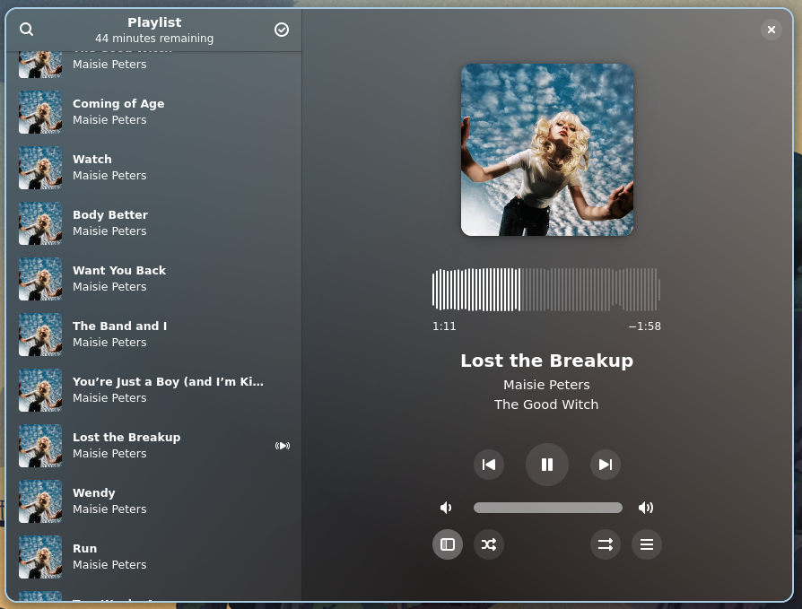
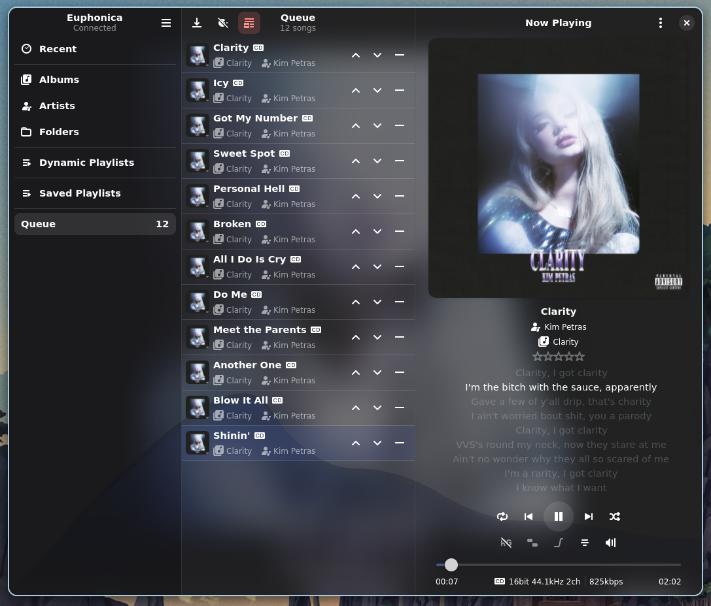
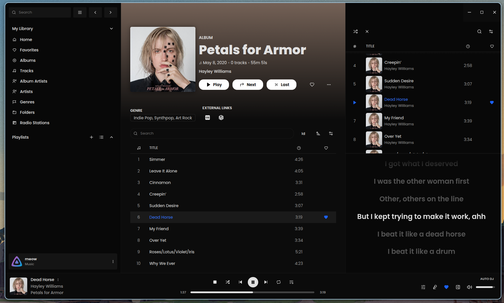
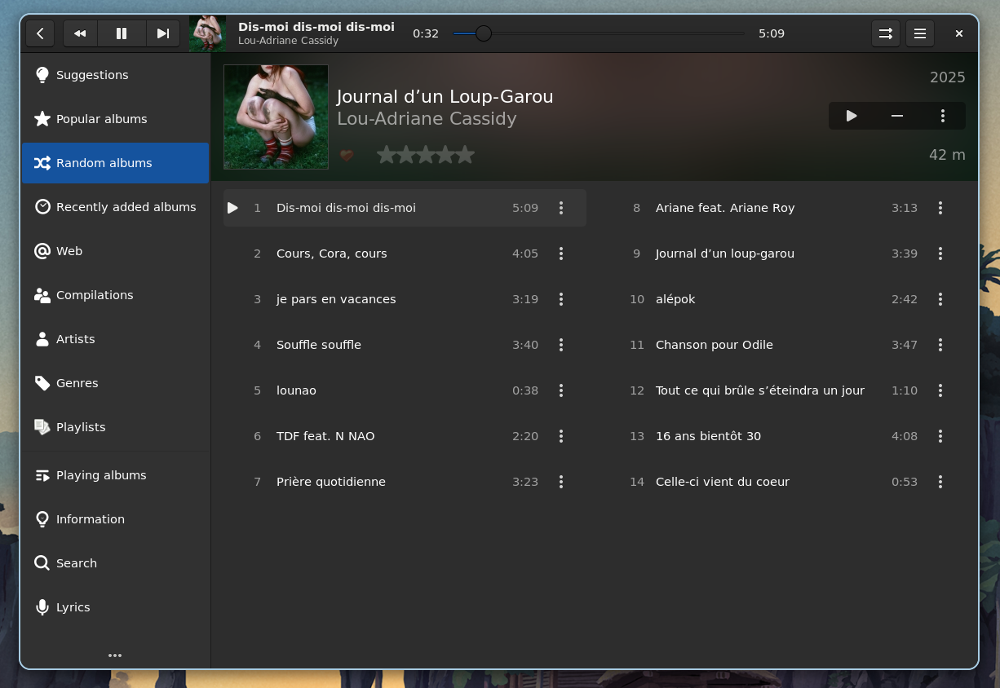
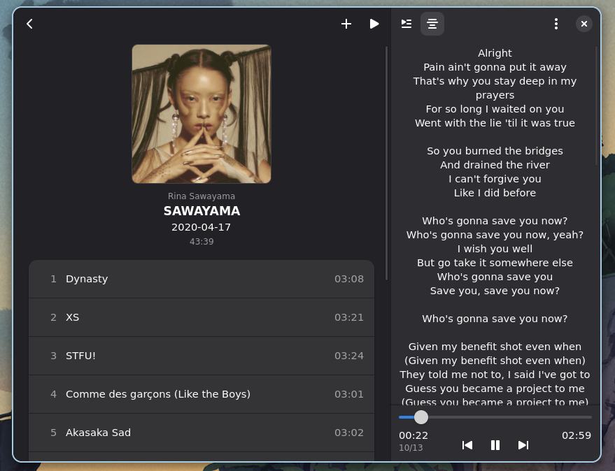
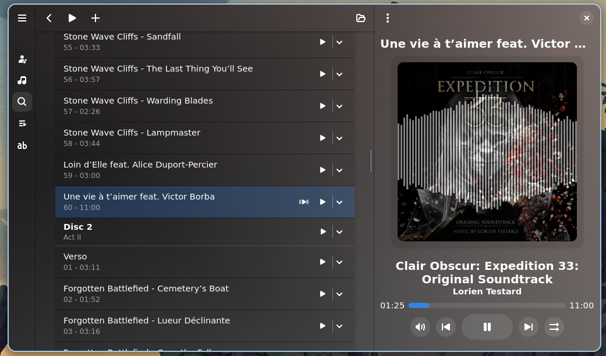
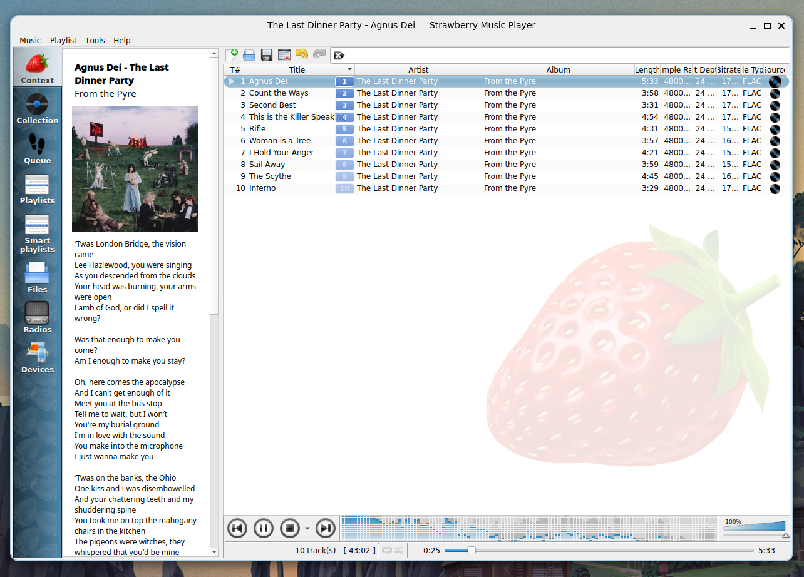
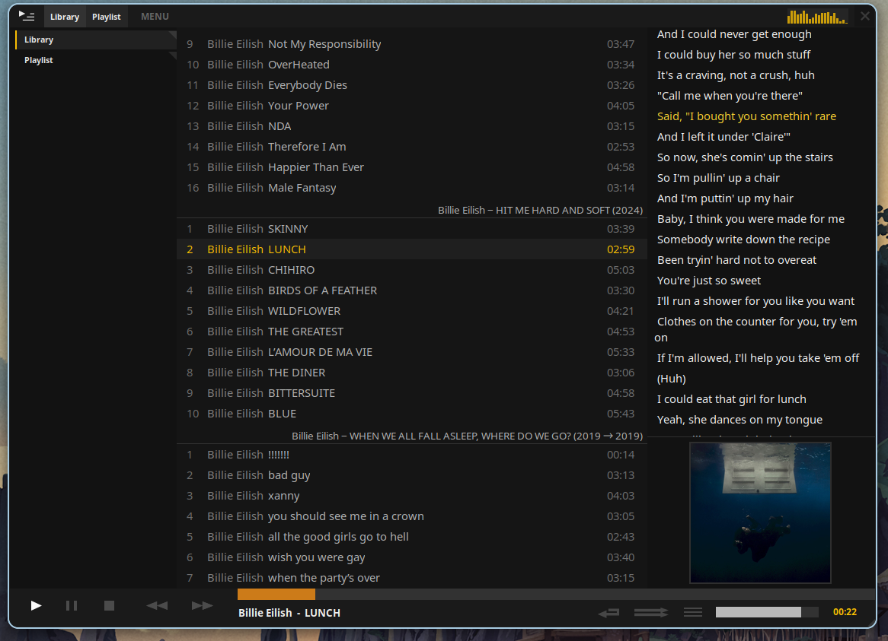

# 2026年Linux音乐播放器的现状

[原文链接](https://crescentro.se/posts/linux-music-players-2026/)

*更新：这篇帖子在 lobste.rs 上发了一个[帖子](https://lobste.rs/s/bpqtph/state_linux_music_players_2026)，里面还有一些友好的朋友们的推荐和想法！*

如果你还没听说，在2026年，我们都将放弃[Microslop](https://www.windowscentral.com/artificial-intelligence/microslop-trends-on-social-media-backlash-to-microsofts-on-going-ai-obsession-continues)，转而使用真正尊重你的系统，同时我们也将放弃[越来越贵的Spotify订阅](https://www.theverge.com/news/862465/spotify-premium-us-price-increase-2026)，以换取我们所消费媒体的真正所有权。所以，为了有趣的二月，我想看看一些我们可以用来填补Spotify形空缺的应用。

## 宣言，如果你不在意那些自以为是的Linux用户抱怨，可以跳过

到目前为止，我坚信即使是直接的盗版，对艺术家来说也比直播更好。至少在Soulseek上搜索你喜欢的艺人不会弹出一堆广告和两个AI生成的模仿品，Spotify宁愿你听，因为他们从中获利更多。

但版权侵权只有在数万亿美元的企业为了养活他们的大型语言模型时才有意义。我们这些农民仍然受常规法律约束。所以不要在谷歌搜索“show girl life torrent safe no virus”。相反，你可以......买便宜的音乐。

不断涌现的黑胶潮流让CD价格暴跌，甚至新发行的CD价格也不到10欧元，老唱片甚至能卖到一半，尤其是如果你查销售数据。如果你不太介意有损格式，iTunes——没错，就是那个苹果的iTunes——会像过去一样在发行当天卖给你无DRM的音乐。最后，大多数未在主流厂牌发行的音乐都会被送到Bandcamp，那里是无损无DRM音乐的另一个平台。

当然，我们已经不再生活在石器时代，所以没人指望你随身携带你的Discman或iPod。只需五分钟，就能把一张CD放进廉价光驱，把高质量的FLAC录入你的光驱，然后你可以从世界任何地方观看。是的，这项Spotify花了近二十年才摸索出来的先进技术，只需通过像[Jellyfin](https://jellyfin.org/)或[Navidrome](https://github.com/navidrome/navidrome)这样的服务器，在你自己的硬件上运行，只需几个简单步骤就能实现。

你可能会说，拥有房产比租房更贵，尽管价格上涨了不少。当然。但我从2014年到2024年都花了十年Spotify，按旧价钱算是1200欧元。最后，我一无所获。我精心策划的“图书馆”并非属于我——它被一家随时可以涨价的公司挟持。如果我停止付款，所有费用都没了。而且艺术家们也没从中获利——一张专辑买一张专辑轻松就能赚超过一千次播放，现实是我不会流媒体播放一千次。

在版权和法律似乎只被选择性地适用的当下，我更愿意直接支持那些我喜欢且需要帮助的艺术家。至于其他人......嗯，泰勒已经给我弄了右肾，用来买Eras巡演门票。我相信她不会介意我让Opalite转几圈，但不卖掉左边的。

## 比赛

好了，说完这些，我想看看今年Linux音乐播放器的现状。我去搜索“music player”[1](https://crescentro.se/posts/linux-music-players-2026/#fn-1)，结果大约有200个。然后我把范围缩小到几款非流媒体服务的桌面音乐播放器。`nixpkgs`

我找了一些我会期待在普通流媒体应用中看到的功能：

- **外观：**现代且直观的用户界面。看起来像是桌面应用，而不是放大版的手机应用。设计为人类使用（无CLI）。将音乐视为一种艺术形式（看起来不像Excel表格）。
- **本地：**它尊重常见协议——我可以在后台运行，用键盘快捷键控制播放器，并且它会在我的壳里显示为音乐播放器。
- **性能：**导航流畅。搭配中等规模的音乐库效果还算不错。
- **特色：**有“音乐库”的概念。快速、高质量的搜索。播放列表和播放队列易于访问和控制。它尊重现有的元数据，不会通过强制执行自己的方案来破坏我的文件。

以下内容绝不是Linux音乐播放器的全部列表，但我认为涵盖了相当广泛的范围，希望能帮助有人发现一些新东西。我也尽量只展示那些我认为不错或潜力很大的应用——如果我觉得某个应用很糟糕或者不行，我就直接跳过，因为这些应用都是免费且开源的，而且总有人在某个地方投入了一些努力。

## 琥珀醇

[Amberol](https://gitlab.gnome.org/World/amberol) 是一款“小巧简洁的声音和音乐播放器，与 GNOME 集成良好。”

这几乎不符合我对功能的需求标准。但你知道吗？我挺喜欢的！非常简约，没有库管理（除了加载时恢复之前的播放列表），但它做的事情非常出色。刷子上的波形设计非常贴心。它看起来很适合非常随意的听众，或者作为打开音频文件时的默认应用。

## 尤福尼卡

[尤福妮卡](https://github.com/htkhiem/euphonica)是“患有妄想症的多元型人格障碍客户”。要设置Euphonica，你还需要设置MPD，这并不难，你甚至可能更喜欢它，而不是专门为某个应用定制的库。

在我开始这段旅程之前，Euphonica一直是我的日常用车，它相当简单，只是有一些点缀。你有专辑和艺人页面、队列、播放列表，还有同步歌词等不错的附加功能。我也觉得它是列表中最漂亮的——界面有*恰到好处*的特色，让人感觉像是在“发光”，专辑封面得到了应有的充足空间，（可选的）背景可视化工具实现得非常有品味。

它并非没有怪癖。界面在处理大型收藏时有点卡顿，尽管我尽力了，但不知为何只能为ABBA获取任何艺术家的照片（也许开发者是瑞典人？）。我也希望它有歌曲搜索功能，更多排序选项，并且重新排序排队能用拖放而不是按钮来实现。不过我最大的抱怨是，调节音量需要用音量旋钮上的滚作。至少让我点击并上下移动它。

## 飞信

[Feishin](https://github.com/jeffvli/feishin) 是“现代自托管音乐播放器”。你需要一个类似的音乐服务器：支持Jellyfin、Navidrome和Subsonic。

飞新是这份名单中功能最完整的球员。如果你想要你的“个人Spotify”，这就是了。用户界面非常可定制，不仅有搜索功能，还有一个该*死的命令调色板*方便键盘操作，整个体验让人联想到如果流媒体服务更关心用户而非股东时的体验。这包括推荐（来自你自己的图书馆）、精彩片段、统计数据以及其他有趣的内容。当然，很多内容是由Jellyfin本身驱动，但Feishin以连贯、易懂且友好的方式呈现。

并非所有事情都完美无缺。由于Feishin是Electron应用，能与你（可能远程的）音乐服务器通信，游戏中有一些明显的网络特色，比如内容加载时的应用内通知和旋转，以及运行另一个Chrome实例时的不适感。你还依赖Electron音频堆栈。不过这些粗糙之处通常都很小，重要部分表现良好，整个包装绝对值得一试。

## 棒棒糖

[Lollypop](https://gitlab.gnome.org/World/lollypop) 是“一款新的 GNOME 音乐播放应用程序”。

我真的很想喜欢这个应用。“今日专辑”功能非常酷——一个小而简单但用心的专栏（虽然它确实试图让我听Weezer的《蓝色专辑》——但今天不行，撒旦！）。我喜欢它会在“建议”页面打开，而不是按字母顺序列出所有内容。它支持YouTube音乐播放。显然有人非常在意这件事。

另一方面，用户体验很痛苦。入职流程没有提示下一步，调整窗口大小时神奇地出现的隐藏侧边栏，还有你需要点击设置中“重置收藏”标签旁边的“加号”按钮才能添加目录到你的图书馆（是的，我知道“重置收藏”本身就是一个按钮， 但只有鼠标悬停时才会显示成按钮）、队列的位置（隐藏在侧边栏的“播放专辑”项里）......

我知道这些可能是GNOME的说法，但它们确实是**糟糕**的GNOME说法。你完全**可以用** GTK4 做出一个看起来适合 GNOME 桌面的好应用。你只需要无视GNOME开发者告诉你做的所有事情。要勇敢！我相信你，棒棒糖！

## 白银专辑

[Plattenalbum](https://github.com/SoongNoonien/plattenalbum) 是一个专注于专辑的 MPD 客户端。“一边浏览你的收藏，一边欣赏大型专辑封面。播放你的音乐而不管理播放列表“。和之前的MPD客户一样，你需要自带MPD。

Plattenalbum有点像Amberol，如果你在上面加上基础的库搜索功能。如果你偶尔想听完整张专辑，并且大致知道自己想要什么，它会带你达到目标。界面相当简洁简洁，虽然（又是GNOME风格）你看到的就是你看到的——几乎没有什么自定义选项。

我想喜欢这个概念——它让人联想到[Longplay应用](https://longplay.rocks/)，那是一个专注于专辑的Apple Music客户端，适用于iOS和Mac。但《Plattenalbum》稍显不足。你甚至看不到*库里所有*专辑的列表，也只能按奇怪的“姓氏，名字，除非是乐队，然后按字母顺序，除非名字以”The“或”A“开头”。也不支持多碟发行。我觉得这里潜力很大，希望随着时间推移能被实现。

## 唱片盒

[Recordbox](https://codeberg.org/edestcroix/Recordbox) 是“又一款为 Linux 开发的音乐播放器，使用 GTK 和 Libadwaita 为 GNOME 桌面开发”。

Recordbox的入门体验是本列表中所有应用中最好的——点击显眼按钮，选择你的音乐目录，等待明显的进度指示器填满，完成。你会被直接放入一个非常舒适的三屏图书馆界面，让人联想到iTunes曾经的好用时代。

之后我也很开心，只需按Ctrl+F，就能进入通用搜索栏，查找专辑、艺术家或曲目，并有几个明显的下一步选项。即使快速浏览数百张相册，应用依然感觉非常灵敏。*它甚至*能正常显示多张唱片。我还很欣赏专辑会被分组在队列里，所以如果你排了几张专辑，可以把它们作为整体来看（还可以重新排序！），而不是一堆曲目。

我可以挑剔“正在播放”部分，感觉有点没完成，还有一些GNOME的细节，比如在设置窗口里放一些设置（很好），在三点菜单里放一些设置（为什么？）。不过，综合来看，考虑到这是1.0之前的版本，我对开发者在短短两年多的时间里所做的工作感到非常钦佩。干得好！

## 草莓（克莱门汀，阿马罗克）

[Amarok](https://amarok.kde.org/) 无需太多介绍——它是当时*的* Linux 音乐播放器，那时让音频驱动正常工作本身就是一种值得庆祝的事。它对[克莱门汀](https://www.clementine-player.org/)和[草莓](https://www.strawberrymusicplayer.org/)影响很大。我把它们都归为一组，是因为Clementine和Strawberry看起来Amarok的界面就像是从90年代末拖到2010年代初的，而在这三个人中，Strawberry似乎最突出，而Amarok在我的WM上有点bug。

Clementine和Strawberry看起来都很实用，但两者中，Strawberry的画面稍微好一些，因为有上下文面板和设计稍微一致一些。界面仍然没有我期望的直观，也没必要总是在屏幕中央放一个巨大的半透明草莓。不过基础看起来很稳固，我真的认为这个历史悠久的音乐播放器传承有望凭借全新设计重新夺回无可争议的音乐播放器王者之冠，优化体验，削减部分繁琐，并让外观现代化以匹配Plasma桌面的其他部分。

## 陶翁

[陶恩](https://github.com/Taiko2k/Tauon)被称为“当今的音乐播放器”。（看起来以前的标语是“来自未来的Linux桌面音乐播放器”，听起来酷多了，但好吧......）

我得非常坦率地说——我从来不喜欢某些特定类型的音乐播放器那种“一切都是播放列表”的做法。有些人非常推崇，但我觉得它让人感到不知所措和困惑。

不过，如果你喜欢这种风格，Tauon看起来很扎实。界面有点像DJ唱盘——我记得是默认配色方案和拉伸图标。作为原生应用，作非常流畅，滚动8k+曲目感觉很流畅，尽管滚动条不知为何在窗口左侧。导航一开始并不直观，但它确实尽量帮你避开了，我也明白只要稍微努力，我就能学会欣赏它。

Tauon似乎还支持Plex、Subsonic、Jellyfin，甚至Spotify作为网络源，包含标签管理选项、歌词编辑器和Discord集成，如果你喜欢的话。它在特色片方面确实与费欣一较高下。总的来说，如果你认为自己是“高级用户”，并且一直在寻找 foobar2000 的 Linux 版本，这款应用非常适合你。

## 摘要

如果你有Jellyfin或Subsonic兼容服务器，即使没有但愿意花点时间搭建，[Feishin](https://github.com/jeffvli/feishin)也是显而易见的选择。它运行良好，外观现代，功能丰富。一旦设置好，使用起来非常简单。

无论是本地播放还是对电子爱好者的排斥，[Tauon](https://github.com/Taiko2k/Tauon)绝对是高级用户的首选，拥有丰富的复杂功能。否则，[Recordbox](https://codeberg.org/edestcroix/Recordbox)看起来是个很好的选择，如果你已经有MPD服务器，[Euphonica](https://github.com/htkhiem/euphonica)仍然是我的首选。

如果你只是偶尔想弹几首歌，我不知道你为什么一直看这些，[Amberol](https://gitlab.gnome.org/World/amberol) 真的很可爱。

说实话，我对此非常满意。我开始了解这个时有点绝望，但实际上有一个充满活力的原生Linux应用生态系统，人们在打造他们关心的东西，即使所有功能还没完全完善，但已经比以前好得多。希望这些趋势能继续！

*更新：看了很多评论后，很多人提到他们喜欢foobar2000风格的播放器，[fooyin](https://fooyin.org/)是最常见的推荐。我没试过，但看起来很受欢迎。如果你想要更多选择，福音被很多人强烈推荐。*

1. 我用它是因为它是目前最大的Linux软件库，而且我可以不用设置和清理。我相信你最喜欢的包装系统更胜一筹，我不需要别人告诉我。[↩](https://crescentro.se/posts/linux-music-players-2026/#fr-1-1)`nixpkgs``nix run nixpkgs#<app>`