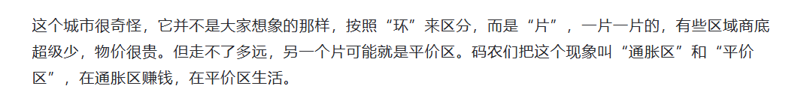

### 260126日记

1. 收到越南华为的面试邀请，周三
2. **传统投资**：核心目标是“让资金增长”，通常表现为追求收益率、跑赢指数或获取分红。资金主要在可变现资产（股票、债券、房地产等）之间流动，终点仍是现金或账面财富的增加。投资者往往以“赚更多钱”为直接诉求。

   **无限投资**：核心目标是“让现金流永续”。第一步就要求把收入转成能生钱的资产，再让这些资产的现金流去覆盖日常开支、偿还负债，最终形成“资产→资产”的正循环，作者称之为“用资产偿还负债、用资产支付开支”。

