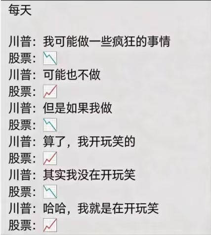

### 260324日记

1. 老特可真是股民的福音，随便一句话都能凭空创造出波动

2. 当前净值1.42，继续努力

3. 目前处于低位的龙头股票

   - **中国能建（601868）**

     - **行业地位**：能源基建央企龙头，参与特高压、算电协同等重大项目。

     - **低位原因**：十五五电网投资、算力保电、央企改革等政策共振，估值低位，资金抱团。

     - **当前股价**：约3-5元区间。

   - **浪潮信息（000877）**
     - **行业地位**：国内AI服务器龙头，深度集成Rubin Ultra架构，液冷PUE＜1.1，适配万卡级智算中心。
     - **低位原因**：国内算力投资持续加码，订单排产饱满，股价处于板块低位。
     - **当前股价**：约20-30元区间。
   - **天孚通信（300305）**
     - **行业地位**：CPO光引擎、激光源核心供应商，英伟达外部激光源唯一A股伙伴。
     - **低位原因**：受益于H200、Rubin架构放量，光器件需求暴增，市值偏小，资金拉升阻力小。
     - **当前股价**：约10-15元区间

