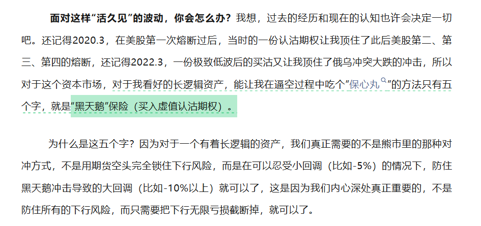

### 260325日记

1. 中东局势缓和，原油大跌，账户又开始回撤，搞些期权防守

2. 中衍的账号今晚激活，放2W进去专门做做，卖方比率价差，看看收益如何

3. 金钱只会流向那些会打理财富的人，你要证明你可以对自己的财富成长负责。

   > 有一次我询问一个成功的基金经理他盈利的秘籍，他的回答如下：
   > *大部分时候，严控风险，赚到比运营成本多一点的钱。当一个真正的好机会（无风险或低风险套利）来临时，加杠杆尽可能利用这个机会赚足够多的钱，直到这个机会消失，真正的好机会总会很快消失。然后再回到低风险交易，然后利用空闲时间努力寻找下一个好机会。仅此而已，并不是什么秘籍。*

