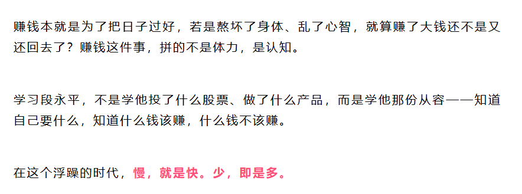

### 260411日记

1. [1677超高频英语单词](https://dlwin888.github.io/2026/04/11/1677%E8%B6%85%E9%AB%98%E9%A2%91%E8%8B%B1%E8%AF%AD%E5%8D%95%E8%AF%8D/)
2. 威廉指标

> 全称是威廉超买超卖指标，核心就是衡量股价在一段时间内的波动范围，判断当前股价是“涨过了头”（超买），还是“跌过了头”（超卖）。它的数值范围在0到100之间，简单记两个关键节点就够了：
>
> **数值低于20，说明股价涨得太猛，大概率要回调，是“卖出信号”；**
>
> **数值高于80，说明股价跌得太狠，大概率要反弹，是“买入信号”。**
>
> 说白了，它就是股市的“反向提醒器”，别人疯狂追涨时，它提醒你该卖；别人恐慌割肉时，它提醒你该买。

