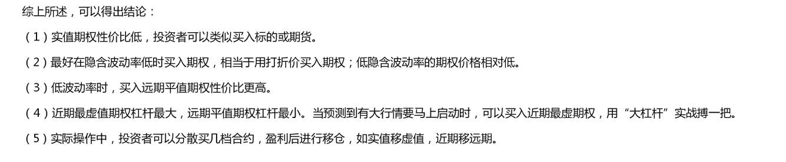

### 260414日记

1. 1677英语第一周

2. 基于日线趋势跟踪的卖方反向比率价差策略

   > **卖 2 手 + 买 1 手**（反向比率，偏裸卖、高收益、有限兜底）
   >
   > 空头趋势：**卖 2 张虚值 / 平值 Call + 买 1 张更深虚值 Call**
   >
   > 多头趋势：**卖 2 张虚值 / 平值 Put + 买 1 张更深虚值 Put**
   >
   > #### 通用规则
   >
   > 1. 趋势判断：日线 MA20 压制 = 空头 → 统一做 **2 卖 Call+1 买 Call**
   >
   > 2. 行权价选择
   >
   >    - 卖出腿：浅虚值 / 近平值 Call（Delta 0.45~0.55），流动性最好
   >    - 买入保护腿：**深度虚值 2~3 档** Call（Delta 0.1~0.15），成本极低
   >
   >    
   >
   > 3. 到期：统一选 **30~40 天 合约期权**
   >
   > 4. 仓位：单品种轻仓，防止反弹脉冲杀波动率

