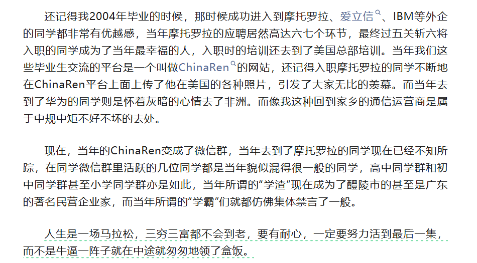

### 260511日记

1. 新的一周，两横一竖继续干

2. **TACO 交易（投机策略）**：**Trump Always Chickens Out**

   > **全称**：**Trump Always Chickens Out**（特朗普总是临阵退缩）
   >
   > **起源**：2025 年由《金融时报》专栏作家 **Robert Armstrong** 创造。
   >
   > #### 核心逻辑
   >
   > 押注特朗普政府的行为模式：**放狠话 → 市场恐慌下跌 → 政策软化 / 退缩 → 市场反弹**。
   >
   > 交易者在**下跌时买入**，在**反弹时卖出**，赚取 **V 型反转** 的差价。
   >
   > #### 四步交易流程
   >
   > 1. **威胁 (Threat)**：宣布极端政策（高额关税、制裁），市场恐慌暴跌。
   > 2. **恐慌 (Panic)**：风险资产（股票、期货）大跌，避险情绪升温。
   > 3. **退缩 (Chicken Out)**：迫于市场 / 政治压力，宣布**推迟、降低或撤销**政策。
   > 4. **反弹 (Opportunity)**：市场情绪修复，大幅反弹，交易者获利了结。
   >
   > #### 典型案例（2025 年）
   >
   > - **对华关税**：宣布加征 **145%** 关税 → 市场暴跌 → 降至 **30%** → 股市反弹。
   > - **对欧盟关税**：威胁 **50%** 关税 → 道指跌 **700 点** → 宣布**推迟** → 标普单日反弹 **2.05%**。

   