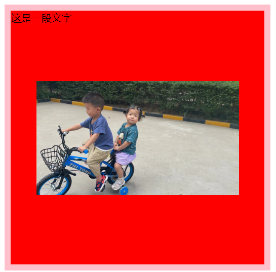

# 背景

## 背景和内容的区别

内容是会撑开容器宽高

背景不会占用容器宽高

## 背景颜色

background-color 背景颜色

- 英文关键字
- RGB
- 十六进制

## 背景图、背景图是否重复

background-image 背景图片

​	url(../img/bg.png);

background-repeat   背景是否重复

- ​	repeat 
  - repeat-x  X轴重复
  - repeat-y   Y轴重复

- ​    no-repeat 不重复

## 背景图位置调整

background-position ：x y; 背景图位置

- 数值
- left right center top bottom

第二个属性不写，默认是center


## 背景图是否跟随滚条滚动

background-attachment: fixed 背景是否滚动

- fixed 固定在浏览器可视区域内
- scroll 跟随滚动条滚动

## background复合样式

background : red url("../images/img/20220817010850.jpg") no-repeat center top scroll;

```css
div {
    width: 400px;
    height: 400px;
    border: 10px solid pink;
    background-color: red;
    background-image: url("../images/img/20220817010850.jpg");
    background-repeat: no-repeat;
    background-position: 10px center;
    background-attachment: fixed;
    background-size: 25%;
}

//复合样式
	div {
		width: 400px;
		height: 400px;
		border: 10px solid pink;
		background : red url("../images/img/20220817010850.jpg") no-repeat center top scroll;
		background-size: 100%;
	}

```



## background练习

1、头部区域（第一个块）直接切一张完整的图片
2、内容区域里的每一个小块需要有ico并且还有背景颜色
