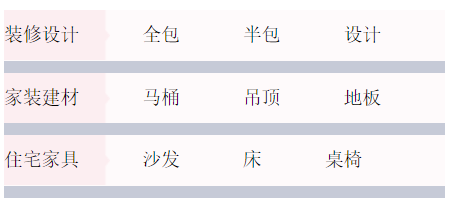

# 文本

## 文字颜色

color

## 文本对齐方式

text-align

- left 默认值 
- right
- center

## 首行缩进

text-indent:2em;

em 是根据字体大小来进行计算的

1em=当前字体大小

## 文本修饰

text-decoration

- underline 下划线
- none  

## 字母间距

letter-spacing：10px;

## 单词间距

word-spacing: 2px; 

以空格为解析单位

## 强制不换行

white-space

- nowrap 不换行
- normal

## 空格大小的测量

测量文字时最好是使用**从上到下**的方式

**一个空格有多大？**

**宋体字体下文字大小的一半**

全角，半角？

字体格式不一样时，空格大小不同

```css
	div {
		width: 200px;
		border: 1px solid red;
		font-size:24px;
		color:red;
		text-align: left;
		text-indent: 2em;
		text-decoration: underline;
		letter-spacing: 2px;
		word-spacing: 20px;
		white-space: nowrap;
	}
```

## 文本（font）属性练习

1. 模块、单词间距、行高要与设计图一致
2. 思考题：每一行的前方粉色带三角的区域该如何实现?



```css
div {
	font-size: 15px;
	font-family: "宋体";
	line-height: 40px;
	text-align: left;
	color: black;
	width: 353px;
	height: 40px;
	word-spacing: 43px;
	background: #fefafb url(../images/img/pink_bg.png) no-repeat 0 0;
	border-bottom: 10px solid #c6cad7;
}
```
