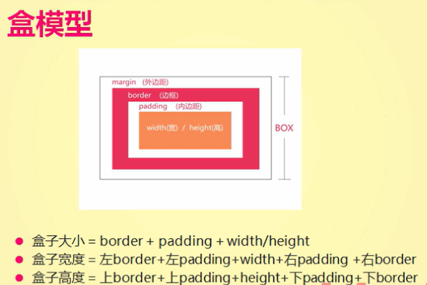
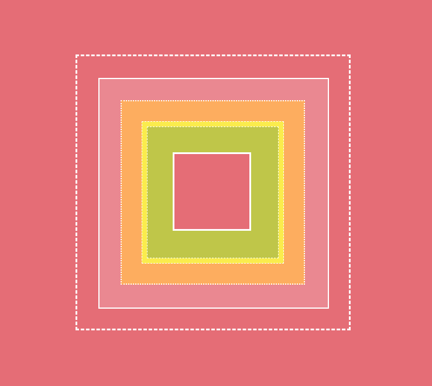

# 盒模型

## 内边距

padding 内填充

- padding-top
- padding-right
- padding-bottom
- padding-left

**设置padding后会撑大容器的大小**

padding复合写法：

- 只有一个属性值时：4个方向是一个值 
- 两个属性值时：第一个是上下，第二个是左右
- 三个属性值时：第一个是上，第二个是左右，第三个是下
- 四个属性值：上 右 下 左

```css
div {
	width: 100px;
	height: 100px;
	padding: 100px;
	background: pink;
}
/* 复合写法 上右下左 */
div {
	padding: 10px 20px 10px 20px;
}
```

## 外边距

margin 外边距

- margin -top
- margin -right
- margin -bottom
- margin -left

```css
div {
	width: 100px;
	height: 100px;
	background: pink;
	margin-top:100px;
}
/* 复合写法 上右下左 */
div {
	margin: 10px 10px 20px 30px;
}
```

margin的常见问题：

1. margin-top会传递给父级

   解决方法：仅用已学知识可使用border解决

2. margin的上下边距会叠压

   解决技巧：

   1. 还是使用margin, 叠压会使用两者中较大的值，将其中一个值设置为预想的值
   2. 如果元素没有特殊特征，也可以使用padding代替

## 盒模型



**练习要求：**
1、两个线框图都得做
2、利用margin完成
3、利用padding完成
4、混合使用margin和padding同时完成

**注意**：
不管是结构还是样式的编码
从外往里（从大往小）进行编码


