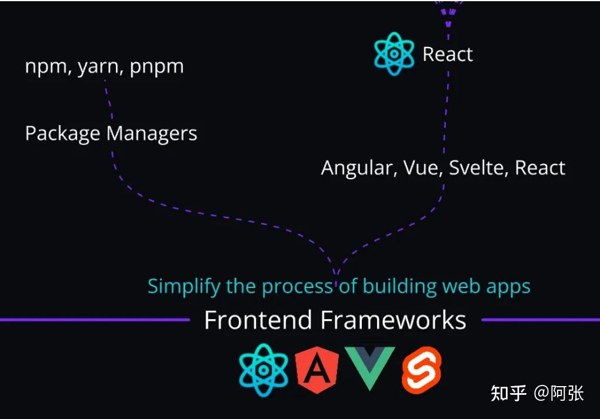
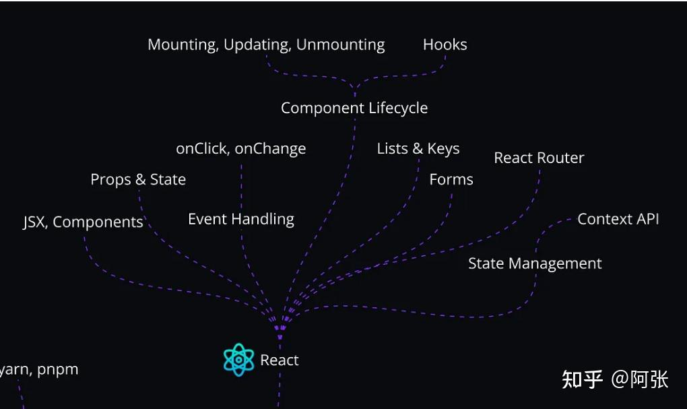

###  6. 前端框架（React 及其替代品）

一旦掌握了 JavaScript，就该进入前端框架的世界了，从 React 开始。

尽管有**Vue.js**和**Angular**等替代方案，但 React 脱颖而出，因为：

- 它是业界使用最广泛的框架。
- 与其他选择相比，这里拥有最多的职位空缺。
- 其庞大的社区保证了丰富的学习资源和支持。

React 是一个强大且流行的构建用户界面的库，在使用 React 的过程中，您自然会了解**包管理器（如 npm 或 Yarn）。**

**时间表**：如果您投入持续的时间，学习 React 基础知识通常需要**1 个月。**

这些是 2025 年成为前端开发人员所需的基本技能。但是，我们还有一些额外的技能可以帮助您在其他开发人员中脱颖而出。
