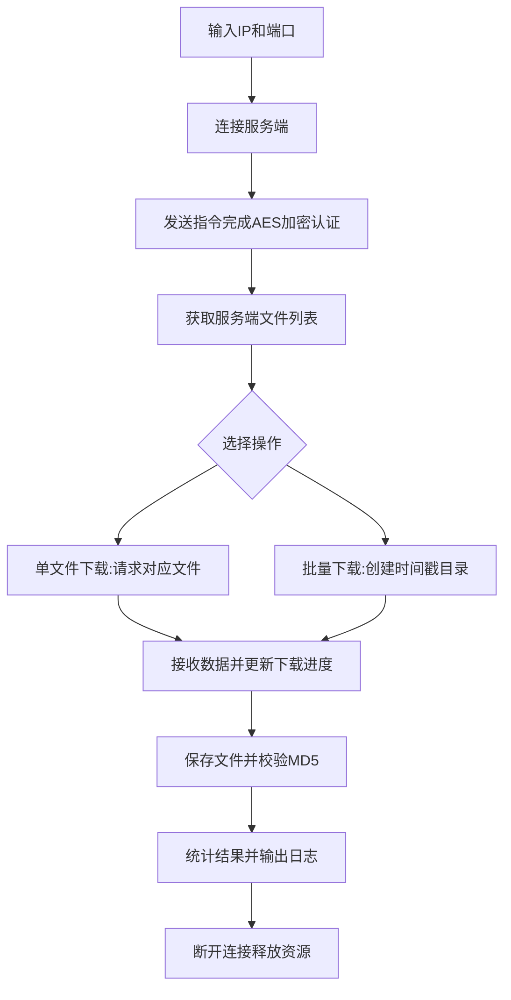
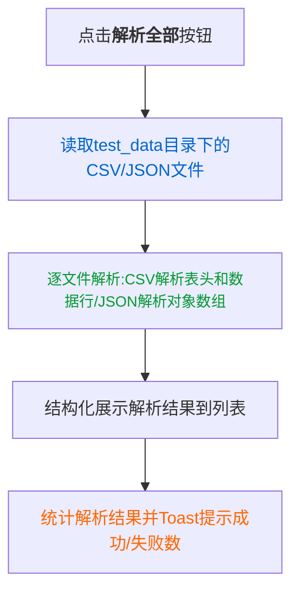

### Android TCP客户端+本地文件解析应用总结

#### 一、整体功能概述

该Android项目是基于`MainActivity.java`构建的**TCP客户端+本地文件解析**混合应用，核心能力分为两大核心模块，既支持与服务端的GB协议网络通信，也支持脱离服务端的本地CSV/JSON文件解析，适用于文件下载、格式解析、数据校验等场景。

##### 核心模块划分

|模块|核心能力|
|---|---|
|TCP网络通信模块|与服务端建立GB协议连接、完成AES加密认证、获取文件列表、单文件/批量文件下载（含MD5完整性校验）|
|本地文件解析模块|读取工程`assets/test_data`目录下的CSV/JSON文件，解析内容并结构化展示到UI|
#### 二、核心组件与工具类

|类名|核心作用|
|---|---|
|`MainActivity`|应用核心页面，整合UI交互、TCP通信流程、文件下载逻辑、本地解析触发与结果展示|
|`GBPackageClass`|GB协议数据包实体模型，封装Header/Cmd/Ack/UUID/Length/数据体/BCC等协议字段|
|`PackBuildService`|GB协议数据包构建工具，负责数据包组装、BCC异或校验计算、十六进制/字节数组转换|
|`PackParseService`|GB协议数据包解析工具，将服务端响应字节数组解析为标准化的`GBPackageClass`对象|
|`CryptoUtils`|加密工具类，实现AES-CBC加密（适配服务端认证流程，兼容C#的PKCS7Padding）|
|`MD5Utils`|MD5校验工具类，计算文件/字节数组的MD5值，下载完成后自动校验文件完整性|
|`MockParseApi`|本地文件解析工具，读取`assets`目录下CSV/JSON文件并解析内容|
|`Constant`|全局常量类，定义缓冲区大小、文件保存路径、时间格式、日志标签等通用配置|
#### 三、核心业务流程

##### 1. TCP通信与文件下载流程


##### 2. 本地CSV/JSON解析流程


#### 四、关键特性与优化

##### 1. UI体验优化

- 进度可视化：单文件/批量下载进度条实时更新，显示「百分比+字节数」双维度进度；

- 日志自动滚动：新增日志后自动定位到底部，无需手动滑动；

- 状态区分：文件列表/解析结果状态互斥，避免误操作；

- 结果统计：解析/下载完成后明确展示成功/失败数量，提升可读性。

##### 2. 稳定性保障

- 线程安全：所有UI更新通过`mainHandler`实现，避免子线程操作UI导致崩溃；

- 异常处理：IO/网络操作全覆盖try-catch，捕获异常并日志输出；

- 资源释放：文件流/网络流及时关闭，页面销毁时清空Handler消息、断开TCP连接；

- 数据安全：文件大小使用`long`类型，避免大文件数值溢出。

##### 3. 功能完整性

- 自动校验：文件下载后自动计算MD5值，日志输出校验结果；

- 目录容错：下载前检查/创建保存目录，失败时给出明确提示；

- 协议适配：完整实现GB协议的数据包组装、解析、BCC校验逻辑；

- 多格式支持：兼容CSV/JSON两种本地文件格式解析。

#### 五、权限与依赖

##### 1. 核心权限（AndroidManifest.xml）

```XML

<!-- 网络通信必备 -->
<uses-permission android:name="android.permission.INTERNET" />
<!-- 存储权限（Android 10+可省略，使用应用私有目录） -->
<uses-permission android:name="android.permission.WRITE_EXTERNAL_STORAGE" android:maxSdkVersion="28" />
<uses-permission android:name="android.permission.READ_EXTERNAL_STORAGE" android:maxSdkVersion="28" />
```

##### 2. 依赖说明

- 无第三方库依赖，仅使用Android原生API和JDK加密/IO相关类；

- 兼容Android主流版本（建议minSdkVersion ≥ 21）。

#### 六、可扩展方向

|扩展点|实现建议|
|---|---|
|文件筛选功能|添加输入框，支持按文件名关键词过滤解析/下载的文件|
|下载重试机制|为下载失败的文件增加重试按钮，配置重试次数上限|
|断点续传|记录已下载字节数，中断后重新请求时从断点位置继续下载|
|MD5手动对比|新增输入框，支持手动输入MD5值与下载文件的MD5结果对比验证|
|Android 10+存储适配|使用MediaStore替代外部存储目录，适配Scoped Storage政策|
|JSON解析UI暴露|在UI增加「解析JSON」按钮，触发MockParseApi的JSON解析逻辑|
#### 七、核心使用说明

1. **TCP功能使用**：输入服务端IP/端口 → 点击「连接」完成认证 → 获取文件列表 → 选择单文件/批量下载；

2. **本地解析功能使用**：将CSV/JSON文件放入`src/main/assets/test_data`目录 → 无需连接服务端，直接点击「解析全部」即可查看结果；

3. **日志查看**：所有操作（连接、下载、解析、校验）的日志均实时输出到UI日志区域，可追溯操作过程与异常信息。
> （注：文档部分内容可能由 AI 生成）