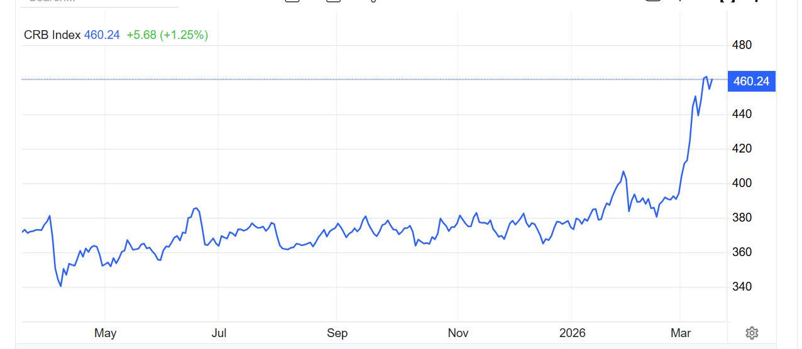

### CRB指数

**[CRB指数](https://zh.tradingeconomics.com/commodity/crb)**是一个跟踪多种大宗商品价格的指数，包含19种商品，如原油、黄金、玉米等。根据最新数据，**CRB指数自2025年初以来上涨了6.98点，涨幅为1.96%**，并且在2008年达到了470.17的历史最高点。该指数的组成包括能源、软性商品、贵金属与工业金属、农产品和畜牧产品。

Crb指数在2026年3月16日跌至454.56点，比前一天下降1.57%。在过去一个月中，crb指数的价格上涨了19.45%，与去年同期相比上涨了22.98%，根据跟踪该商品基准市场的差价合约（cfd）交易数据。 历史上，CRB商品指数在2008年7月达到了470.17的历史最高点。

