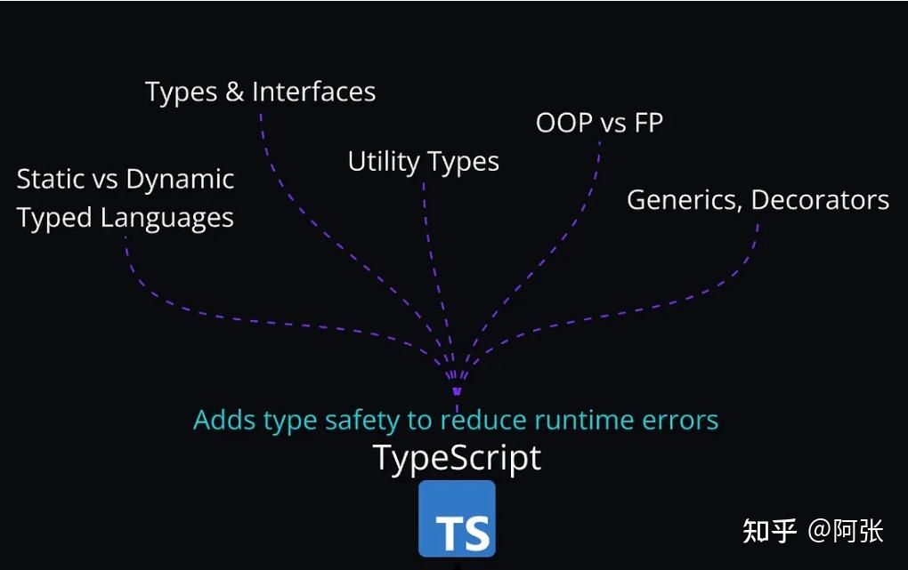

### 额外技能

#### CSS 相关的额外技能

- CSS 预处理器：学习**Sass、Less和Stylus**等工具，使编写 CSS 更高效、更易于维护。
- CSS 框架：探索流行的框架，如Tailwind CSS和Bootstrap，以快速设计响应式、现代的布局，而无需从头开始编写每种样式。

#### JavaScript 相关额外技能

- 一旦您掌握了基础知识，这些高级 JavaScript 工具和概念就可以让您脱颖而出。
- Linters 和 Formatters ：Prettier和ESLint等工具有助于确保一致的代码格式并捕获潜在的错误。
- 模块和模块捆绑器：了解 JavaScript 模块和工具（如Vite和Webpack），以优化和捆绑您的代码。
- 内存泄漏：了解如何识别和修复内存泄漏以提高应用程序性能。
- 浏览器 DevTools：使用浏览器内置工具掌握调试和性能分析。
- Web API：发现内置浏览器 API，用于执行诸如获取数据、操作 DOM 或访问地理位置等任务。

#### TypeScript

深入研究 TypeScript 以增强代码质量和可扩展性。

#### **React 相关的额外技能**

- **内置组件**：有效使用 React 的内置组件来改善应用程序的结构。
- **CSS-in-JS**：学习在 React 组件内管理样式的技术。
- **Hooks**：超越基础并探索高级 React hooks。
- **React 19 功能**：了解 React 19 中的最新功能。
- **高阶组件（HOC）**：了解如何使用 HOC 重用组件逻辑。
- **服务器端渲染（SSR）与单页应用程序（SPA）**：了解何时使用 SSR 进行 SEO 和性能优化。
- **高级状态管理**：深入研究复杂的状态管理场景，可能使用 Redux 或 Zustand 等库。

#### **框架**

**Next.js**：超越 React，学习**Next.js**等框架，以使用 SSR、静态站点生成和 API 路由等功能构建全栈应用程序。

#### **自动化测试**

自动测试可确保您的代码可靠运行。了解以下工具：

- **Jest**、**Vitest**用于单元测试。
- **Cypress**、**Playwright**用于端到端测试。

#### **托管和部署**

了解你的应用的托管选项：

- **静态托管与动态托管**：了解差异并根据您的应用要求选择正确的选项。
