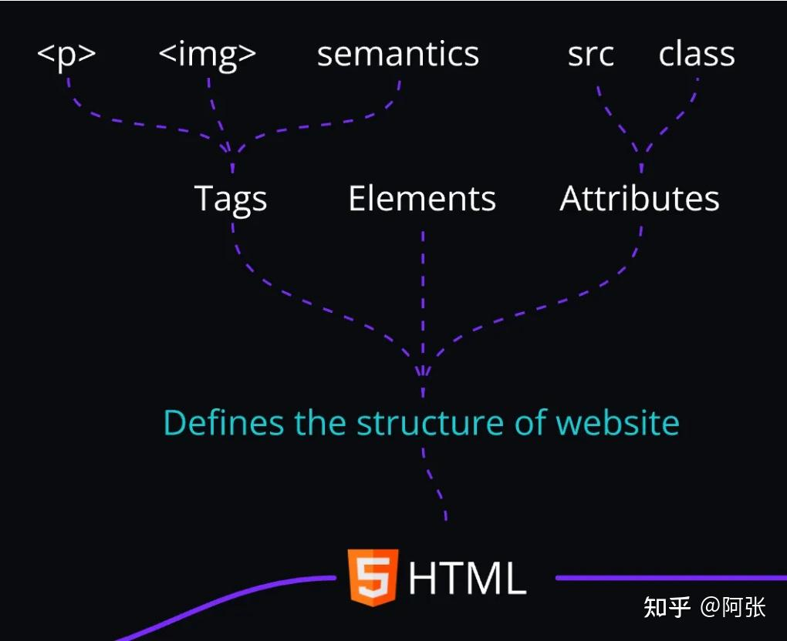
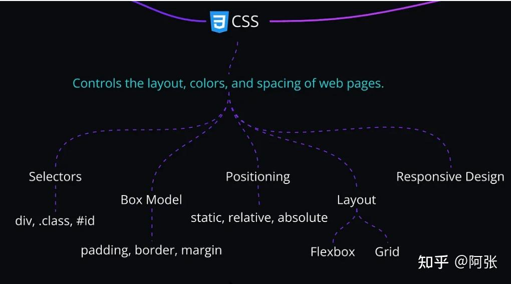

### **3. HTML + CSS**

#### **HTML**

HTML 构建了网络上的内容，例如文本、链接和表单。可以将其视为网页的骨架。

**示例**：使用`<form>`和`<input>`创建登录表单。

#### **CSS**

CSS 设置 HTML 样式，控制布局、颜色和间距。

**示例**：使用 Flexbox 将元素居中或使用 Grid 创建多列布局。

**时间表**：花**一个月**时间掌握这两项技能。
