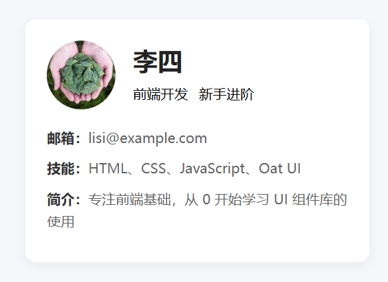
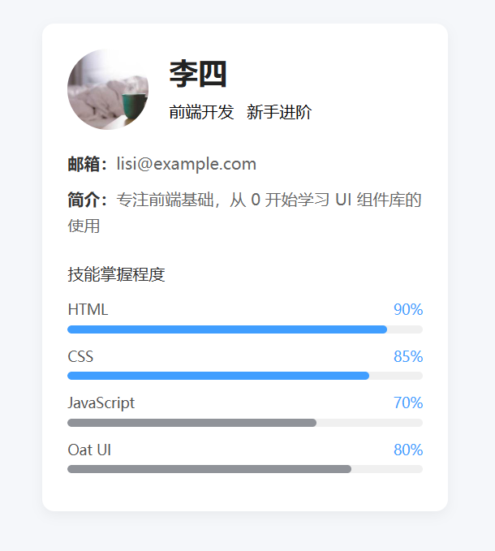

### 项目 1：个人信息卡片（核心：基础组件 + Flex 布局）

#### 1. 核心目标

用 Oat UI 搭建美观的个人信息卡片，掌握「卡片、头像、标签、文本」等基础组件的使用，练习 Flex 布局居中、间距控制。

#### 2. 技术要点

- `@knadh/oat` 核心组件：`oat-card`/`oat-avatar`/`oat-badge`/`oat-text`

- Flex 布局：`display: flex` 实现元素水平 / 垂直居中

- 自定义样式：补充 Oat UI 基础样式的不足（如卡片阴影、间距）

  ​	[在线查看](https://m3u8player.com.cn/htmlcss/%E4%B8%AA%E4%BA%BA%E4%BF%A1%E6%81%AF%E5%8D%A1%E7%89%871.html)

#### 3. 完整可运行代码

```html
<!DOCTYPE html>
<html lang="zh-CN">
<head>
  <meta charset="UTF-8">
  <meta name="viewport" content="width=device-width, initial-scale=1.0">
  <title>入门级1 - 个人信息卡片</title>
  <!-- 引入 Oat UI 核心资源 -->
  <link rel="stylesheet" href="https://unpkg.com/@knadh/oat/oat.min.css">
  <script src="https://unpkg.com/@knadh/oat/oat.min.js" defer></script>
  
  <style>
    /* 全局重置 + 基础样式 */
    * {
      margin: 0;
      padding: 0;
      box-sizing: border-box;
      font-family: "Microsoft Yahei", sans-serif;
    }
    body {
      background-color: #f5f7fa;
      padding: 50px 20px;
    }
    /* 卡片容器：居中 + 限制宽度 */
    .card-container {
      max-width: 400px;
      margin: 0 auto;
    }
    /* Oat UI 卡片自定义样式（官方仅提供基础样式） */
    .oat-card {
      padding: 25px;
      border-radius: 12px;
      box-shadow: 0 4px 12px rgba(0,0,0,0.05);
      background: #fff;
    }
    /* 头像区域：Flex 居中 */
    .avatar-group {
      display: flex;
      align-items: center;
      margin-bottom: 20px;
    }
    /* 头像大小控制 */
    .oat-avatar {
      width: 80px;
      height: 80px;
      border-radius: 50%;
      margin-right: 20px;
      object-fit: cover;
    }
    /* 信息文本样式 */
    .info-item {
      margin-bottom: 10px;
      color: #666;
      line-height: 1.6;
    }
    .info-item strong {
      color: #333;
    }
    /* 标签间距 */
    .oat-badge {
      margin-right: 8px;
      margin-top: 5px;
    }
  </style>
</head>
<body>
  <div class="card-container">
    <div class="oat-card">
      <!-- 头像 + 名称区域 -->
      <div class="avatar-group">
        
        <div>
          <h2 style="margin: 0 0 8px 0; color: #222;">李四</h2>
          <span class="oat-badge oat-badge-primary">前端开发</span>
          <span class="oat-badge oat-badge-secondary">新手进阶</span>
        </div>
      </div>
      
      <!-- 个人信息 -->
      <div class="info-group">
        <p class="info-item"><strong>邮箱：</strong>lisi@example.com</p>
        <p class="info-item"><strong>技能：</strong>HTML、CSS、JavaScript、Oat UI</p>
        <p class="info-item"><strong>简介：</strong>专注前端基础，从 0 开始学习 UI 组件库的使用</p>
      </div>
    </div>
  </div>
</body>
</html>
```



#### 4. 拓展练习（巩固知识点）

1. 新增「技能进度条」：用 `div` 模拟进度条，结合 Oat UI 颜色类（`oat-bg-primary`）实现技能熟练度展示；
2. 鼠标悬浮效果：给卡片添加 `hover` 动效（如 `transform: translateY(-5px)`、阴影加深）；
3. 适配移动端：调整小屏幕下卡片的 padding、头像大小。



```html
<!DOCTYPE html>
<html lang="zh-CN">
<head>
  <meta charset="UTF-8">
  <meta name="viewport" content="width=device-width, initial-scale=1.0">
  <title>拓展练习 - 个人信息卡片</title>
  <!-- 引入 Oat UI 核心资源 -->
  <link rel="stylesheet" href="https://unpkg.com/@knadh/oat/oat.min.css">
  <script src="https://unpkg.com/@knadh/oat/oat.min.js" defer></script>
  
  <style>
    /* 全局重置 + 基础样式 */
    * {
      margin: 0;
      padding: 0;
      box-sizing: border-box;
      font-family: "Microsoft Yahei", sans-serif;
    }
    body {
      background-color: #f5f7fa;
      padding: 50px 20px;
    }
    /* 卡片容器：居中 + 限制宽度 */
    .card-container {
      max-width: 400px;
      margin: 0 auto;
      transition: all 0.3s ease;
    }
    /* 鼠标悬浮效果 */
    .oat-card {
      padding: 25px;
      border-radius: 12px;
      box-shadow: 0 4px 12px rgba(0,0,0,0.05);
      background: #fff;
      transition: transform 0.3s ease, box-shadow 0.3s ease;
    }
    .oat-card:hover {
      transform: translateY(-5px);
      box-shadow: 0 8px 20px rgba(0,0,0,0.1);
    }
    /* 头像区域 */
    .avatar-group {
      display: flex;
      align-items: center;
      margin-bottom: 20px;
    }
    .oat-avatar {
      width: 80px;
      height: 80px;
      border-radius: 50%;
      margin-right: 20px;
      object-fit: cover;
    }
    /* 信息文本样式 */
    .info-item {
      margin-bottom: 10px;
      color: #666;
      line-height: 1.6;
    }
    .info-item strong {
      color: #333;
    }
    /* 标签间距 */
    .oat-badge {
      margin-right: 8px;
      margin-top: 5px;
    }

    /* 技能进度条（核心修改：替换 CSS 变量为固定颜色） */
    .skills-section {
      margin-top: 25px;
    }
    .skills-title {
      font-size: 16px;
      color: #333;
      margin-bottom: 15px;
      font-weight: 500;
    }
    .skill-item {
      margin-bottom: 12px;
    }
    .skill-header {
      display: flex;
      justify-content: space-between;
      font-size: 14px;
      margin-bottom: 5px;
    }
    .skill-name {
      color: #555;
    }
    .skill-percent {
      /* 直接用 Oat UI primary 色值 #409eff */
      color: #409eff;
      font-weight: 500;
    }
    .progress-bar-container {
      width: 100%;
      height: 8px;
      background-color: #f0f0f0;
      border-radius: 4px;
      overflow: hidden;
    }
    .progress-bar {
      height: 100%;
      border-radius: 4px;
      transition: width 1s ease;
    }
    /* ========== 关键修改：替换 CSS 变量为固定色值 ========== */
    .progress-html {
      width: 90%;
      background-color: #409eff; /* Oat UI primary 主色 */
    }
    .progress-css {
      width: 85%;
      background-color: #409eff;
    }
    .progress-js {
      width: 70%;
      background-color: #909399; /* Oat UI secondary 次要色 */
    }
    .progress-oat {
      width: 80%;
      background-color: #909399;
    }

    /* 移动端适配 */
    @media (max-width: 768px) {
      body {
        padding: 30px 15px;
      }
      .oat-card {
        padding: 20px 15px;
      }
      .oat-avatar {
        width: 60px;
        height: 60px;
        margin-right: 15px;
      }
      .progress-bar-container {
        height: 6px;
      }
      .info-item, .skill-header {
        font-size: 13px;
      }
      .skills-title {
        font-size: 15px;
      }
    }
    @media (max-width: 480px) {
      .avatar-group {
        flex-direction: column;
        text-align: center;
        margin-bottom: 15px;
      }
      .oat-avatar {
        margin-right: 0;
        margin-bottom: 10px;
      }
    }
  </style>
</head>
<body>
  <div class="card-container">
    <div class="oat-card">
      <div class="avatar-group">
        
        <div>
          <h2 style="margin: 0 0 8px 0; color: #222;">李四</h2>
          <span class="oat-badge oat-badge-primary">前端开发</span>
          <span class="oat-badge oat-badge-secondary">新手进阶</span>
        </div>
      </div>
      
      <div class="info-group">
        <p class="info-item"><strong>邮箱：</strong>lisi@example.com</p>
        <p class="info-item"><strong>简介：</strong>专注前端基础，从 0 开始学习 UI 组件库的使用</p>
      </div>

      <div class="skills-section">
        <h3 class="skills-title">技能掌握程度</h3>
        <div class="skill-item">
          <div class="skill-header">
            <span class="skill-name">HTML</span>
            <span class="skill-percent">90%</span>
          </div>
          <div class="progress-bar-container">
            <div class="progress-bar progress-html"></div>
          </div>
        </div>
        <div class="skill-item">
          <div class="skill-header">
            <span class="skill-name">CSS</span>
            <span class="skill-percent">85%</span>
          </div>
          <div class="progress-bar-container">
            <div class="progress-bar progress-css"></div>
          </div>
        </div>
        <div class="skill-item">
          <div class="skill-header">
            <span class="skill-name">JavaScript</span>
            <span class="skill-percent">70%</span>
          </div>
          <div class="progress-bar-container">
            <div class="progress-bar progress-js"></div>
          </div>
        </div>
        <div class="skill-item">
          <div class="skill-header">
            <span class="skill-name">Oat UI</span>
            <span class="skill-percent">80%</span>
          </div>
          <div class="progress-bar-container">
            <div class="progress-bar progress-oat"></div>
          </div>
        </div>
      </div>
    </div>
  </div>
</body>
</html>
```

