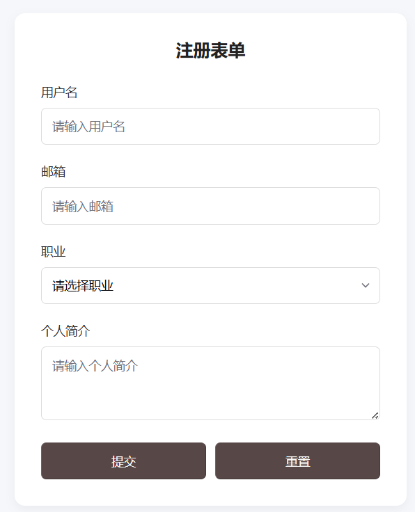
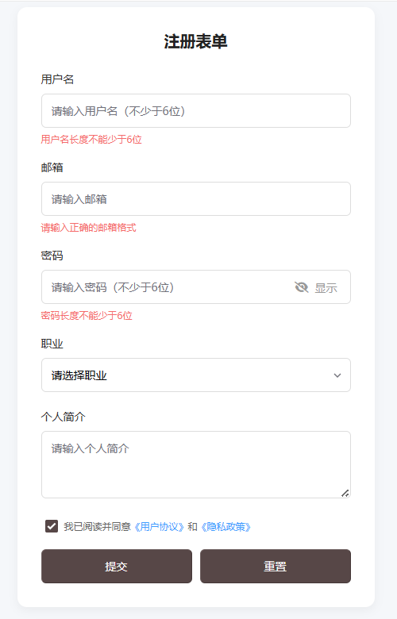

# 项目 2：基础表单（核心：表单组件 + 简单交互）

#### 1. 核心目标

用 Oat UI 搭建「登录 / 注册」表单，掌握输入框、按钮、下拉框、标签等表单组件的使用，练习表单样式美化和简单交互。

#### 2. 技术要点

- `@knadh/oat` 表单组件：`oat-label`/`oat-input`/`oat-select`/`oat-btn`/`oat-textarea`

- 表单交互：按钮点击事件、Oat UI 内置 `toast` 提示

- 样式优化：表单元素间距、聚焦样式、按钮样式自定义

  [在线查看](https://m3u8player.com.cn/htmlcss/%E5%9F%BA%E7%A1%80%E8%A1%A8%E5%8D%952.html)

#### 3. 完整可运行代码

```html
<!DOCTYPE html>
<html lang="zh-CN">
<head>
  <meta charset="UTF-8">
  <meta name="viewport" content="width=device-width, initial-scale=1.0">
  <title>入门级2 - 基础表单</title>
  <link rel="stylesheet" href="https://unpkg.com/@knadh/oat/oat.min.css">
  <script src="https://unpkg.com/@knadh/oat/oat.min.js" defer></script>
  
  <style>
    * {
      margin: 0;
      padding: 0;
      box-sizing: border-box;
      font-family: "Microsoft Yahei", sans-serif;
    }
    body {
      background-color: #f5f7fa;
      padding: 50px 20px;
    }
    /* 表单容器 */
    .form-container {
      max-width: 450px;
      margin: 0 auto;
    }
    /* 表单卡片 */
    .oat-card {
      padding: 30px;
      border-radius: 12px;
      box-shadow: 0 4px 12px rgba(0,0,0,0.05);
      background: #fff;
    }
    /* 表单标题 */
    .form-title {
      font-size: 20px;
      color: #222;
      margin-bottom: 25px;
      text-align: center;
    }
    /* 表单项间距 */
    .form-item {
      margin-bottom: 20px;
    }
    /* 标签样式 */
    .oat-label {
      display: block;
      margin-bottom: 8px;
      color: #333;
      font-weight: 500;
    }
    /* 输入框/下拉框/文本域统一样式 */
    .oat-input, .oat-select, .oat-textarea {
      width: 100%;
      padding: 10px 12px;
      border-radius: 6px;
      border: 1px solid #ddd;
      font-size: 14px;
    }
    /* 输入框聚焦样式 */
    .oat-input:focus, .oat-select:focus, .oat-textarea:focus {
      outline: none;
      border-color: #409eff;
      box-shadow: 0 0 0 2px rgba(64, 158, 255, 0.1);
    }
    /* 按钮容器：居中 */
    .btn-group {
      display: flex;
      gap: 10px;
      margin-top: 15px;
    }
    /* 按钮样式 */
    .oat-btn {
      flex: 1;
      padding: 10px 0;
      border-radius: 6px;
      cursor: pointer;
      font-size: 14px;
    }
  </style>
</head>
<body>
  <div class="form-container">
    <div class="oat-card">
      <h2 class="form-title">注册表单</h2>
      <form id="registerForm" class="oat-form">
        <!-- 用户名 -->
        <div class="form-item">
          <label class="oat-label" for="username">用户名</label>
          <input type="text" id="username" class="oat-input" placeholder="请输入用户名" required>
        </div>
        <!-- 邮箱 -->
        <div class="form-item">
          <label class="oat-label" for="email">邮箱</label>
          <input type="email" id="email" class="oat-input" placeholder="请输入邮箱" required>
        </div>
        <!-- 职业 -->
        <div class="form-item">
          <label class="oat-label" for="career">职业</label>
          <select id="career" class="oat-select">
            <option value="">请选择职业</option>
            <option value="frontend">前端开发</option>
            <option value="backend">后端开发</option>
            <option value="design">UI 设计</option>
          </select>
        </div>
        <!-- 个人简介 -->
        <div class="form-item">
          <label class="oat-label" for="intro">个人简介</label>
          <textarea id="intro" class="oat-textarea" rows="3" placeholder="请输入个人简介"></textarea>
        </div>
        <!-- 按钮组 -->
        <div class="btn-group">
          <button type="button" class="oat-btn oat-btn-primary" id="submitBtn">提交</button>
          <button type="reset" class="oat-btn oat-btn-default" id="resetBtn">重置</button>
        </div>
      </form>
    </div>
  </div>

  <script>
    // 等待 DOM 加载完成
    document.addEventListener('DOMContentLoaded', () => {
      // 获取元素
      const submitBtn = document.getElementById('submitBtn');
      const resetBtn = document.getElementById('resetBtn');
      const form = document.getElementById('registerForm');

      // 提交按钮事件
      submitBtn.addEventListener('click', () => {
        // 简单表单验证
        const username = document.getElementById('username').value;
        const email = document.getElementById('email').value;
        
        if (!username) {
          oat.toast('请输入用户名！', { type: 'error' });
          return;
        }
        if (!email) {
          oat.toast('请输入邮箱！', { type: 'error' });
          return;
        }

        // 验证通过，提示成功
        oat.toast('注册成功！', { type: 'success' });
        // 重置表单
        form.reset();
      });

      // 重置按钮事件
      resetBtn.addEventListener('click', () => {
        oat.toast('表单已重置', { type: 'info' });
      });
    });
  </script>
</body>
</html>
```



#### 4.  拓展练习

1. 新增「密码框 + 密码可见切换」：用 `type="password"` + 按钮切换 `type="text"`；
2. 表单验证增强：检查邮箱格式、用户名长度（不少于 6 位）；
3. 新增「同意协议复选框」：使用 `oat-checkbox`，未勾选时禁止提交。

```html
<!DOCTYPE html>
<html lang="zh-CN">
<head>
  <meta charset="UTF-8">
  <meta name="viewport" content="width=device-width, initial-scale=1.0">
  <title>入门级2 - 基础表单（拓展版）</title>
  <link rel="stylesheet" href="https://unpkg.com/@knadh/oat/oat.min.css">
  
  <style>
    * {
      margin: 0;
      padding: 0;
      box-sizing: border-box;
      font-family: "Microsoft Yahei", sans-serif;
    }
    body {
      background-color: #f5f7fa;
      padding: 50px 20px;
    }
    /* 表单容器 */
    .form-container {
      max-width: 450px;
      margin: 0 auto;
    }
    /* 表单卡片 */
    .oat-card {
      padding: 30px;
      border-radius: 12px;
      box-shadow: 0 4px 12px rgba(0,0,0,0.05);
      background: #fff;
    }
    /* 表单标题 */
    .form-title {
      font-size: 20px;
      color: #222;
      margin-bottom: 25px;
      text-align: center;
    }
    /* 表单项间距 */
    .form-item {
      margin-bottom: 20px;
    }
    /* 标签样式 */
    .oat-label {
      display: block;
      margin-bottom: 8px;
      color: #333;
      font-weight: 500;
    }
    /* 输入框/下拉框/文本域统一样式 */
    .oat-input, .oat-select, .oat-textarea {
      width: 100%;
      padding: 10px 12px;
      border-radius: 6px;
      border: 1px solid #ddd;
      font-size: 14px;
    }
    /* 输入框聚焦样式 */
    .oat-input:focus, .oat-select:focus, .oat-textarea:focus {
      outline: none;
      border-color: #409eff;
      box-shadow: 0 0 0 2px rgba(64, 158, 255, 0.1);
    }
    /* ========== 拓展1：密码框样式（新增） ========== */
    /* 密码输入框容器：相对定位承载切换按钮 */
    .password-group {
      position: relative;
    }
    /* 密码可见切换按钮 */
    .password-toggle {
      position: absolute;
      right: 12px;
      top: 50%;
      transform: translateY(-50%);
      background: transparent;
      border: none;
      outline: none;
      cursor: pointer;
      color: #999;
      font-size: 14px;
      padding: 2px 5px;
    }
    .password-toggle:hover {
      color: #409eff;
    }
    /* ========== 拓展2：验证错误提示（新增） ========== */
    .error-tip {
      color: #f56c6c; /* Oat UI危险色 */
      font-size: 12px;
      margin-top: 5px;
      height: 14px; /* 固定高度避免布局跳动 */
      visibility: hidden; /* 默认隐藏 */
    }
    .error-tip.show {
      visibility: visible; /* 验证失败时显示 */
    }
    /* ========== 拓展3：同意协议复选框（新增） ========== */
    .agreement-group {
      display: flex;
      align-items: center;
      padding-left: 5px;
    }
    .oat-checkbox {
      margin-right: 8px;
      cursor: pointer;
    }
    .agreement-text {
      font-size: 12px;
      color: #666;
    }
    .agreement-text a {
      color: #409eff;
      text-decoration: none;
    }
    .agreement-text a:hover {
      text-decoration: underline;
    }
    /* 按钮容器：居中 */
    .btn-group {
      display: flex;
      gap: 10px;
      margin-top: 15px;
    }
    /* 按钮样式 */
    .oat-btn {
      flex: 1;
      padding: 10px 0;
      border-radius: 6px;
      cursor: pointer;
      font-size: 14px;
    }
    /* 禁用状态按钮（拓展3） */
    .oat-btn:disabled {
      background-color: #e6e6e6;
      color: #999;
      cursor: not-allowed;
      border-color: #e6e6e6;
    }
  </style>
</head>
<body>
  <div class="form-container">
    <div class="oat-card">
      <h2 class="form-title">注册表单</h2>
      <form id="registerForm" class="oat-form">
        <!-- 用户名 -->
        <div class="form-item">
          <label class="oat-label" for="username">用户名</label>
          <input type="text" id="username" class="oat-input" placeholder="请输入用户名（不少于6位）" required>
          <div class="error-tip" id="usernameTip">用户名长度不能少于6位</div>
        </div>
        <!-- 邮箱 -->
        <div class="form-item">
          <label class="oat-label" for="email">邮箱</label>
          <input type="email" id="email" class="oat-input" placeholder="请输入邮箱" required>
          <div class="error-tip" id="emailTip">请输入正确的邮箱格式</div>
        </div>
        <!-- ========== 拓展1：密码框（新增） ========== -->
        <div class="form-item">
          <label class="oat-label" for="password">密码</label>
          <div class="password-group">
            <input type="password" id="password" class="oat-input" placeholder="请输入密码（不少于6位）" required>
            <button type="button" class="password-toggle" id="passwordToggle">
              <i class="fas fa-eye-slash"></i> 显示
            </button>
          </div>
          <div class="error-tip" id="passwordTip">密码长度不能少于6位</div>
        </div>
        <!-- 职业 -->
        <div class="form-item">
          <label class="oat-label" for="career">职业</label>
          <select id="career" class="oat-select">
            <option value="">请选择职业</option>
            <option value="frontend">前端开发</option>
            <option value="backend">后端开发</option>
            <option value="design">UI 设计</option>
          </select>
        </div>
        <!-- 个人简介 -->
        <div class="form-item">
          <label class="oat-label" for="intro">个人简介</label>
          <textarea id="intro" class="oat-textarea" rows="3" placeholder="请输入个人简介"></textarea>
        </div>
        <!-- ========== 拓展3：同意协议复选框（新增） ========== -->
        <div class="form-item agreement-group">
          <input type="checkbox" class="oat-checkbox" id="agreementCheck">
          <label class="agreement-text" for="agreementCheck">
            我已阅读并同意<a href="javascript:alert('用户协议详情');">《用户协议》</a>和<a href="javascript:alert('隐私政策详情');">《隐私政策》</a>
          </label>
        </div>
        <!-- 按钮组 -->
        <div class="btn-group">
          <button type="button" class="oat-btn oat-btn-primary" id="submitBtn" disabled>提交</button>
          <button type="reset" class="oat-btn oat-btn-default" id="resetBtn">重置</button>
        </div>
      </form>
    </div>
  </div>

  <!-- 引入Font Awesome图标（用于密码切换按钮） -->
  <link rel="stylesheet" href="https://cdn.bootcdn.net/ajax/libs/font-awesome/6.4.0/css/all.min.css">
  <!-- 引入Oat UI JS（放在最后避免未初始化） -->
  <script src="https://unpkg.com/@knadh/oat/oat.min.js"></script>
  
  <script>
    // 等待 DOM 加载完成
    document.addEventListener('DOMContentLoaded', () => {
      // 获取核心元素
      const submitBtn = document.getElementById('submitBtn');
      const resetBtn = document.getElementById('resetBtn');
      const form = document.getElementById('registerForm');
      // 拓展功能元素
      const username = document.getElementById('username');
      const email = document.getElementById('email');
      const password = document.getElementById('password');
      const passwordToggle = document.getElementById('passwordToggle');
      const agreementCheck = document.getElementById('agreementCheck');
      // 错误提示元素
      const usernameTip = document.getElementById('usernameTip');
      const emailTip = document.getElementById('emailTip');
      const passwordTip = document.getElementById('passwordTip');

      // ========== 拓展1：密码可见/隐藏切换逻辑 ==========
      let isPasswordVisible = false;
      passwordToggle.addEventListener('click', () => {
        if (isPasswordVisible) {
          // 隐藏密码
          password.setAttribute('type', 'password');
          passwordToggle.innerHTML = '<i class="fas fa-eye-slash"></i> 显示';
        } else {
          // 显示密码
          password.setAttribute('type', 'text');
          passwordToggle.innerHTML = '<i class="fas fa-eye"></i> 隐藏';
        }
        isPasswordVisible = !isPasswordVisible;
      });

      // ========== 拓展2：表单验证增强逻辑 ==========
      // 验证规则：邮箱格式
      const validateEmail = (emailVal) => {
        const reg = /^[a-zA-Z0-9._%+-]+@[a-zA-Z0-9.-]+\.[a-zA-Z]{2,}$/;
        return reg.test(emailVal);
      };
      // 验证规则：长度≥6位
      const validateLength = (val) => {
        return val.trim().length >= 6;
      };

      // 用户名实时验证
      username.addEventListener('blur', () => {
        if (!validateLength(username.value)) {
          usernameTip.classList.add('show');
        } else {
          usernameTip.classList.remove('show');
        }
      });
      // 邮箱实时验证
      email.addEventListener('blur', () => {
        if (!validateEmail(email.value)) {
          emailTip.classList.add('show');
        } else {
          emailTip.classList.remove('show');
        }
      });
      // 密码实时验证
      password.addEventListener('blur', () => {
        if (!validateLength(password.value)) {
          passwordTip.classList.add('show');
        } else {
          passwordTip.classList.remove('show');
        }
      });

      // ========== 拓展3：同意协议复选框逻辑 ==========
      agreementCheck.addEventListener('change', () => {
        // 勾选则启用提交按钮，否则禁用
        submitBtn.disabled = !agreementCheck.checked;
      });

      // ========== 提交按钮事件（增强验证） ==========
      submitBtn.addEventListener('click', () => {
        let isFormValid = true;

        // 最终验证：用户名
        if (!validateLength(username.value)) {
          usernameTip.classList.add('show');
          isFormValid = false;
        } else {
          usernameTip.classList.remove('show');
        }
        // 最终验证：邮箱
        if (!validateEmail(email.value)) {
          emailTip.classList.add('show');
          isFormValid = false;
        } else {
          emailTip.classList.remove('show');
        }
        // 最终验证：密码
        if (!validateLength(password.value)) {
          passwordTip.classList.add('show');
          isFormValid = false;
        } else {
          passwordTip.classList.remove('show');
        }
        // 最终验证：协议勾选（双重保险）
        if (!agreementCheck.checked) {
          oat.toast('请阅读并同意用户协议！', { type: 'error' });
          isFormValid = false;
        }

        // 所有验证通过
        if (isFormValid) {
          oat.toast('注册成功！', { type: 'success' });
          form.reset();
          // 重置后恢复初始状态
          agreementCheck.checked = false;
          submitBtn.disabled = true;
          isPasswordVisible = false;
          password.setAttribute('type', 'password');
          passwordToggle.innerHTML = '<i class="fas fa-eye-slash"></i> 显示';
        }
      });

      // ========== 重置按钮事件 ==========
      resetBtn.addEventListener('click', () => {
        // 重置错误提示
        usernameTip.classList.remove('show');
        emailTip.classList.remove('show');
        passwordTip.classList.remove('show');
        // 重置密码框状态
        isPasswordVisible = false;
        password.setAttribute('type', 'password');
        passwordToggle.innerHTML = '<i class="fas fa-eye-slash"></i> 显示';
        // 重置协议勾选和按钮状态
        agreementCheck.checked = false;
        submitBtn.disabled = true;
        // 提示
        oat.toast('表单已重置', { type: 'info' });
      });
    });
  </script>
</body>
</html>
```


