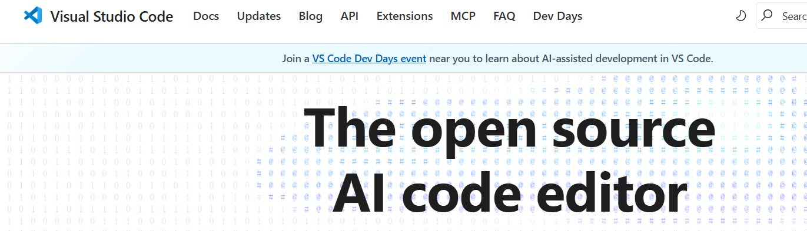

### **2. 工作区设置**

设置编码工具：

- **代码编辑器**：使用 [VS Code](https://code.visualstudio.com/)。
- **扩展**：添加 [Prettier](https://www.prettier.cn/)（用于格式化）和 [ESLint](https://eslint.nodejs.cn/)（用于错误检测）等工具。
- **可选**：熟悉用于运行脚本和版本控制的终端。

这种设置提高了生产效率。**1天**就足以开始。

