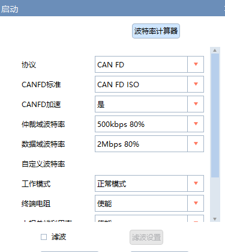
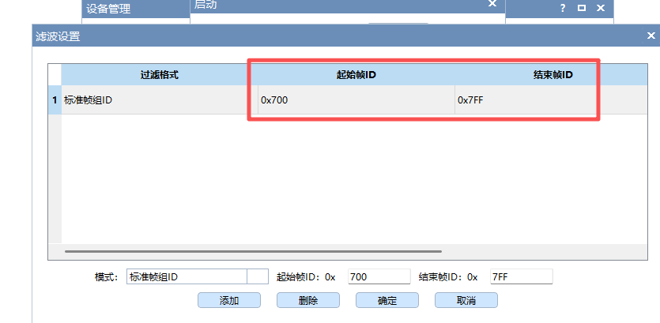

# EDR读取学习

## 1. 基础概念
- CAN总线协议，标准帧/扩展帧，帧ID，过滤器
- 功能寻址：标准帧`7DF`、拓展帧`18DBFFF1`
- 单帧、多帧，数据帧、远程帧
- 支持协议：CAN\CAN FD\单线CAN\容错CAN\K线\FlexRay

## 2. 周立功ZCANPRO使用

- 设备配置

  

- 滤波配置

  

## 3. 单机EDR使用

- 品牌、年份、车型
- 输入车架号
- 查看接线方式并连接
- 读取

## 4. 博士、美亚等EDR读取设备使用方法

连线、接口协议

## 5. 单机EDR几种常见提示及解决方法
### 5.1 发送数据失败,请检查供电和连线
- 检查设备是否上电
- 气囊读取：查看设备开关是否打开，核对接线图
- OBD读取：检查汽车是否上电（踩刹车/空调出风）、检查线束（2012年前丰田用定义二接辅助2，其余均为定义一）、检查电量
- 若使用辅助设备1，需在上电五秒内点击提取

### 5.2 ECU无应答, 暂无协议
- 核心原因：发送命令无回复
- 解决步骤：
  1. 确认该车型是否支持EDR读取
  2. 若支持CAN/CANFD，使用ZCANPRO/ZLGCAN模拟对应指令发送，查看是否有响应（无响应则判定不可读，原因可能为地址不同、需多次发送、需先发送激活命令）
  3. 根据发送/响应地址匹配对应车型，让用户重新点击读取
- 常见发送/响应地址：
  0x7F1--0x7F9（大部分国标）、0x737—0x73F、0x752—0x722、0x6F1—0x601、0x6E0--0x51C、0x641—0x651(特斯拉)、0x780—0x788(丰田)、0x7D2—0x7D3(现代)、0x744—0x4C4(吉普)、0x6E0—0x51C(吉普)、0x18DA53F1—0x18DAF153、0x64A—0x489、0x7E5—0x7ED、0x742—0x7C2、0x781—0x789、0x7A0—0x7A8、0x7DF—0x738、0x752—0x772、0x18DBFFF1--18DAF100~18DAF1FF

### 5.3 闪退
- 先观察读取进度条，判断闪退发生在**读取阶段**还是**生成报告阶段**
- 使用日志解密工具解密`edr.log`，定位闪退原因后针对性解决
- 发送时闪退：多为地址错误导致
- 生成报告闪退：多为代码问题（如数组越界），可取回对应车型`.csv`文件，修改代码后重新生成报告

### 5.4 打开设备失败
- 核心原因：电脑与EDR主机连接失败
- 解决步骤：
  1. 检查连线，确认EDR设备上`PWD`、`SYS`指示灯均为绿色
  2. 打开电脑设备管理器，检查USB设备中是否能识别`CANFD-200U`
  3. 若以上步骤无效，重新安装EDR软件或重启电脑/设备
  4. 安装补丁程序：路径为微盘/EDR共享文档/单机EDR/`MSVBCRT.AIO.2019.10.19.X86 X64.exe`

### 5.5 常见基础问题
- 辅助设备3：仅气囊读取时使用，OBD读取一般无需（宝马、奥迪等车型），其中奥迪分45、55两种类型
- 辅助设备2：使用定义2的线束，可单独使用（老款丰田、通用AB10a气囊）
- 辅助设备1：专用于通用系车型（别克、雪佛兰、凯迪拉克）

### 5.6 寻址基础概念
1. 发送地址`0x7DF`为**功能寻址**（广播），CAN总线上所有ECU都会返回，各设备对应不同返回地址
2. 其余发送地址为**物理寻址**，仅指向的ECU可回复
3. `0x7F`为否定应答标识

### 5.7 调试总线方法（新版本软件）
1. 点击软件左上角图标，打开调试软件
2. 依次点击**打开设备→初始化CAN→启动CAN**，若最下方数据框出现数据，且点击发送无报错，说明总线正常
3. 关闭设备后，将滤波模式改为**标准帧**，重新打开设备（可过滤绝大部分无用数据）
4. 使用`7DF`地址发送命令，查看响应地址中是否有常见有效地址，且无`0x7F`否定应答

## 6. 数据监听及模拟器编写

- 别克SDM50模拟器
- 现代模拟器
- 本田模拟器 LVHFE1653N6094604
- 特斯拉模拟器 监听、抓取

## 7. 采集数据解析

0xFA13\0xFA14\0xFA15

- 单个信号长度、数量
- 字节序号
- 转化公式
- 无法获取值
- 无效值

## 8. 售后问题处理记录
- 奇瑞2026：国标CAN，帧ID：`746`，F190（获取vin）、FA13(事件一)出现否定应答，判定为**该指令/功能不支持**
- 奔驰 2020：LE4ZG7HB0LL553553，单机版提示FA12否定应答，不支持，使用博士读取，一样显示否定应答
- 特斯拉models 2017: 5YJSA3H1XEFP47425, 数据不完整，FD93命令解析代码问题，4G版已修复
