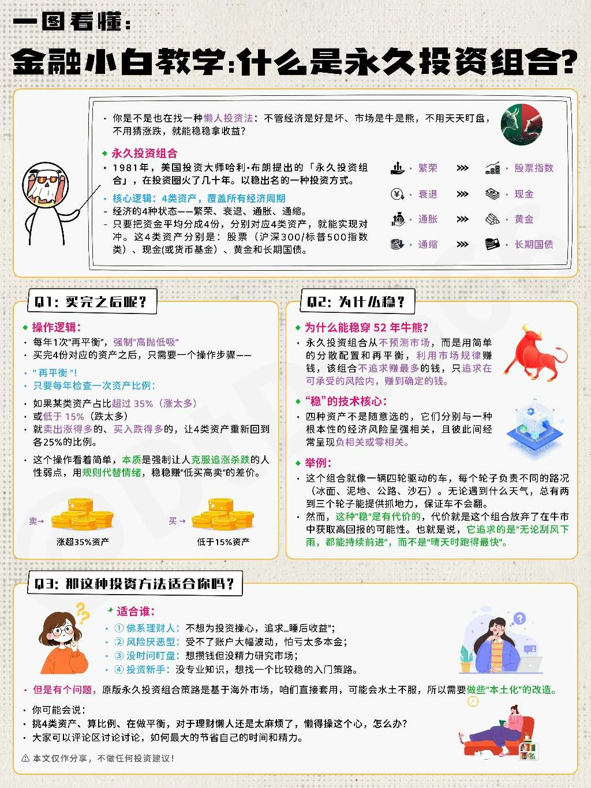

### 我的永久投资组合

股票，纳斯达克100+标普500

债券，30年国债etf 511090

黄金，比特币替代

现金，余额宝

哈利·布朗提出一个永久有效的投资组合：操作简单，无需选择投资时机，在任何经济状况下都能增加财富的投资方法。

书中有长篇的理论说明和数据验证，这里我们直接上结论。

一、投资配置

25% 股票

25% 债券

25% 黄金

25% 现金

二、调整方式

1、任何一项资产价值超过总价值的35%时调整

2、任何一项资产价值跌破总价值的15%时调整

3、若没有触发1和2，则每年一次调整

三、实操举例

1、初始配置：

假设你有40,000元，按照永久投资组合原则分配：

25% 即10,000元：股票，购买标准普尔500指数基金

25% 即10,000元：债券，购买25～30年的美国长期国债

25% 即10,000元：黄金，购买实物黄金

25% 即10,000元：现金，购买最多12个月到期的美国国债

PS：永久投资组合中的“现金”代表可以随时转换为可直接使用的货币的资产。

2、维护调整：

经过一年，期间没有触发35/15%调整带，但各类资产比例发生变化如下：

股票跌10%：9,000元

债券涨3%：10,300元

黄金涨30%：13,000元

现金涨1%：10,100元

总资产：42,400元

最后，高卖低补，让每个类别恢复到25%的比例，即：42,400元 * 25% = 10600元。

PS：如果触发35/15%调整带，操作方式同上，略过不表。

3、长期效果：

随着时间推移，通过定期平衡，该组合的实际年收益（指高出通胀率的实际收益，中国最近十年的平均通货膨胀率为2.26%）在3%～6%。该方法风险低，且可以穿越经济周期。

