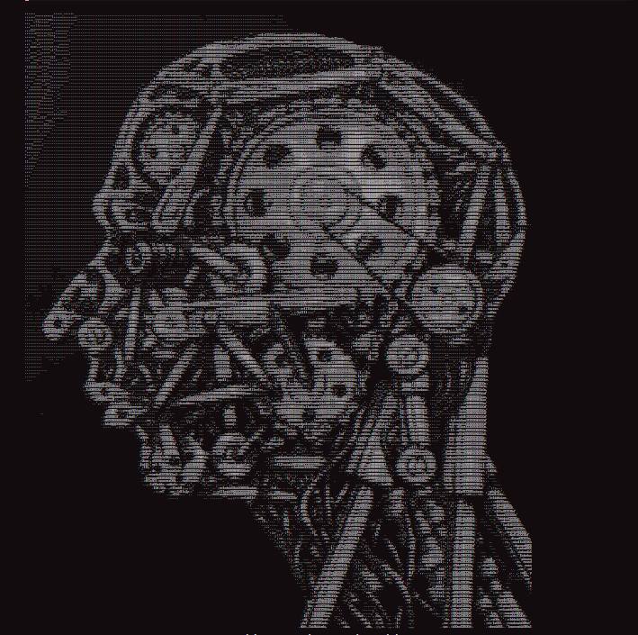

### 别成为机器

[原文链接](https://blog.armeet.ca/becoming-the-machine/)

最近有人推荐我看了一个标题为这样的YouTube视频：

> 只有奴隶通过生产力来量化自己的存在
>
> 
>
> ​																	Machine Head - 德里克·霍布斯 1995

我在圣何塞湾区长大。写这篇文章时，我们公司刚刚从2025年秋季YC毕业班毕业。我对“忙碌”文化并不陌生。我现在能走到今天，完全靠坚韧和高中、大学时投入的努力。不过最近，作为创始人，我对Twitter（X）和LinkedIn的关注度提高了，紧跟*其*动态。

我的时间线上有大量“努力”文化被推崇。

- 一些表演性帖子，展示自己在最荒谬的环境中编程
- 如果你不完成X，你就达不到（X是某个脱节的工作时间目标）
- 早上好，帖子和各种激怒诱饵互动刷怪策略
- 比例与一胜

每台机器都有其用途。人需要*目标*。*成为机器*的诱惑比以往任何时候都更大。这台机器的承诺令人着迷。如果我能继续前进，我最终会到达一个不属于这里的地方。如果我能把自己变成一个接受输入并持续朝着某个目标努力的机制，我就会成功。

我相信努力工作，但我认为拼搏文化和我时间线上推销的*愿景*是腐败的。它专为吸引人而设计，由数百万玩家相互竞争，目标只有一个：吸引你的注意力。

你工作不够努力。你需要在凌晨5点起床。你必须第一个到，最后一个离开。

这种信息传递有效。看着我。我觉得有必要写一篇帖子来谈谈这件事。但这完全是错误的。

拼命文化优化工作投入，因为它很*吸引*人。发布输入很容易。面对输出很难。

事实是，你不必成为机器才能成功。机器无法适应。它无法学习游戏规则。它是决定论的，固定在原地，以线性节奏推进。

相反，要追求灵活应变。快速适应。定义你的目标，但不要让它成为你的目标。你的目标是神圣的;只有你自己真正理解它。做你需要做的事，才能实现目标。不要为了汗水而优化。尽量找到最有回报的解决方案。优化关键：速度、效率还是质量——无论它是什么。

你不是机器。你是个人。发挥你的优势。要像手术刀一样敏锐和有策略，而不是像锤子那样钝。别再迷恋磨炼过程了。梦想更大。

**你不是个愚蠢的钝器。别再装作人了。**
