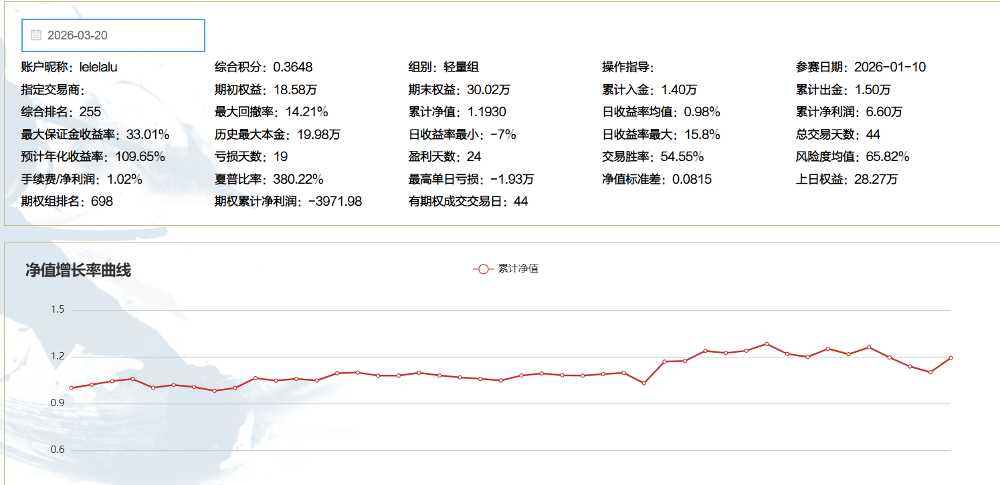

### 参赛账号分析

这份[网页展示](https://www.dggaoshou.com/futures_detail.html?capitalAccount=B1399B757C8B4689C8DD1B9A8494520A64D521BE3532492DC6976C6A509BBAA8&stage=9)的是一位昵称为 **lelelalu** 的参赛者在“夺冠高手”期货实盘大赛中的详细战绩。从数据来看，这是一位**表现非常优秀、处于快速上升期的轻量级选手**。

虽然昵称看起来比较随意，但其交易数据在“轻量组”中属于顶尖水平。以下是对该账户核心数据的深度分析：

### 1. 核心战绩概览

| 指标         | 数值                        | 解读                                 |
| ------------ | --------------------------- | ------------------------------------ |
| **参赛时间** | 2026-01-10 至今 (约2.5个月) | 交易历史较短，处于爆发期             |
| **资金规模** | 历史最高本金约 20万         | 典型的轻量组资金级别                 |
| **收益率**   | **119.30%** (累计净值)      | **极其惊人**，2个多月本金翻倍        |
| **最大回撤** | 14.21%                      | 控制得非常好，盈亏比健康             |
| **交易胜率** | 54.55%                      | 属于高胜率交易者                     |
| **夏普比率** | 380.22%                     | 风险调整后的收益极高，说明收益很“稳” |

### 2. 深度分析

#### 💰 收益能力：爆发力极强

- **资金曲线陡峭**：该选手从参赛至今（约44个交易日），权益从18.58万增长至30.02万，累计净利润6.6万，累计净值达到 **1.1930**。
- **年化收益率**：预计年化收益率高达 **109.65%**。这在期货交易中属于非常顶尖的水平，说明其策略在当前市场环境下非常有效。
- **盈亏同源**：虽然最大单日亏损达到-1.93万（占本金比例不小），但最大单日盈利高达15.8%，说明其具备捕捉大行情的能力，且敢于在机会来临时下注。

#### 🛡️ 风险控制：攻守兼备

- **低回撤**：在取得高收益的同时，最大回撤率仅为 **14.21%**。对于一个资金翻倍的账户来说，这个回撤控制得非常出色。
- **交易频率**：总交易天数44天，亏损天数19天，盈利天数24天。这表明该选手**并非频繁交易**，而是倾向于捕捉确定性较高的机会。

#### ⚠️ 潜在隐忧：期权策略亏损

- **期权业务拖后腿**：虽然期货交易大获成功，但数据显示其期权累计净利润为 **-3971.98元**。这说明该选手可能在期权方向上尝试了卖方策略或方向性判断失误，虽然目前金额不大，但值得警惕。

### 3. 总结与建议

**总结：** 这是一位**天赋异禀且执行力极强**的短线或波段交易者。在短短2个多月的时间里，通过54%的胜率和极佳的回撤控制，实现了资金的大幅增值。其夏普比率（380%）极高，意味着每承担一份风险获得的超额回报非常可观。

**建议：**

1. **警惕“暴利后的回撤”**：高收益往往伴随着人性的膨胀。建议在当前高点适当锁定利润，不要因为之前的高收益而增加过度的杠杆。
2. **修正期权策略**：目前的期权交易是亏损项，建议复盘期权部分的逻辑，或者暂时专注于其擅长的期货方向。
3. **关注长期稳定性**：目前数据仅覆盖44天，属于“短期爆发”。建议观察其在不同市场周期（如震荡市）下的表现，以验证策略的普适性。

**一句话评价：** 这是一个正处于“甜蜜期”的优秀账户，策略有效且风控得当，但需注意期权端的亏损以及暴利后的心理管理。