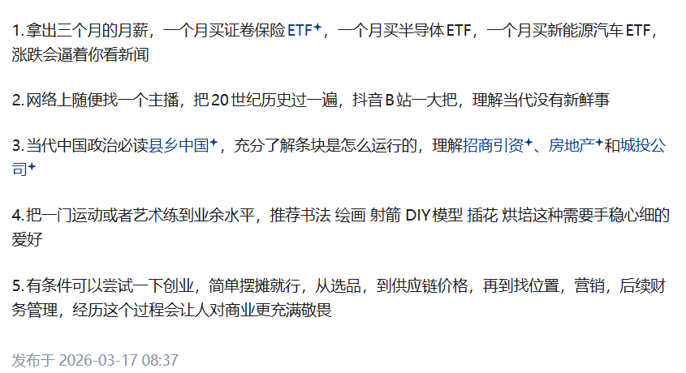

### [怎样避免活在信息茧房之中？](https://www.zhihu.com/question/493477576/answer/2017157672265347561)

这张图是一份**快速认知社会与自我提升的实用清单**，核心是用低成本、高体感的方式，让普通人快速理解商业、社会运行规律，并打磨心性与技能，我帮你逐条拆解：

------

#### 1. 用小额投资倒逼认知市场

- 操作：拿出 3 个月月薪，分别买入**证券保险 ETF、半导体 ETF、新能源汽车 ETF**。
- 目的：不是为了赚快钱，而是通过资产涨跌的切身感受，**主动去关注宏观经济、行业新闻、政策变化**，建立对金融市场和产业周期的直观认知。
- 本质：用真金白银的 “痛感”，强迫自己跳出信息茧房，理解市场波动背后的逻辑。

#### 2. 用历史视角理解当代

- 操作：在抖音、B 站等平台找历史类主播，系统学习**20 世纪世界史与中国史**。
- 目的：建立 “太阳底下无新事” 的历史感，明白当代的科技变革、社会思潮、国际博弈，都能在历史中找到相似的脉络，从而更冷静地看待当下的热点与变局。

#### 3. 用《县乡中国》理解中国治理逻辑

- 操作：阅读《县乡中国》，了解 “条块管理”（条条：垂直部门；块块：地方政府）的运行机制。
- 目的：搞懂**招商引资、房地产、城投公司**等核心经济行为的底层逻辑，理解中国从中央到基层的权力结构与发展动力，是看懂中国经济与政治的入门钥匙。

#### 4. 用手稳心细的爱好打磨心性

- 操作：选择**书法、绘画、射箭、DIY 模型、插花、烘焙**等需要耐心与专注力的运动或艺术，练到业余高手水平。
- 目的：这类爱好能训练专注力、抗挫折力和精细化操作能力，在浮躁的环境中沉淀心性，同时获得审美与成就感，是对抗焦虑的有效方式。

#### 5. 用低成本创业理解商业本质

- 操作：尝试简单摆摊创业，完整经历**选品、供应链议价、选址、营销、财务管理**全流程。
- 目的：亲身体验商业的真实痛点，理解成本、利润、流量、风险的含义，培养对商业的敬畏心，比读 10 本商业书更能建立务实的商业认知。

------

#### 整体逻辑

这份清单的核心是**“体感式学习”**：

- 不用靠高学历或大资本，用**小额投资、历史学习、接地气阅读、爱好修炼、轻创业**这 5 件事，就能快速建立对**金融、历史、政治、心性、商业**的立体认知，是普通人突破认知壁垒、提升社会适应力的高效路径。
