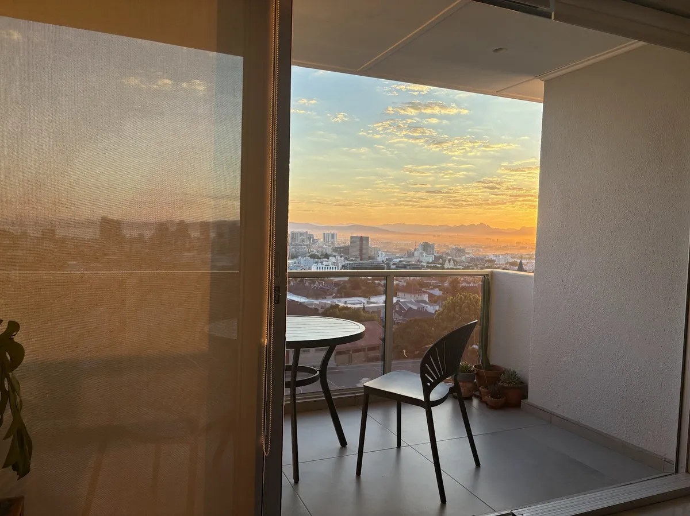

### 成为一个白天生活的人

[原文链接](https://herman.bearblog.dev/becoming-a-day-person/)

*2026年3月19日*

最近有人在一档播客中问我最大的*改变*是什么，是习惯、思维方式、购买还是环境的变化。我不需要四处寻找答案，因为我已经知道我最大的*改变*：成为白天的人。

我的意思是，我是在白天工作，早起，泡好咖啡，和艾玛一起看日出。目睹光明的开始和结束，有种让人脚踏实地的感觉;这让我感觉与这个自然的周期产生共鸣。

我以前是那种熬夜睡到早上大部分时间的人。直到过去五年，我才开始坚持早起床。

我大约早上6点自然醒来，趁还有些迷糊时手工磨咖啡，然后在手冲咖啡盛开时，叫醒艾玛看开普敦的日出，那时空气依然清新凉爽，汽车还没破坏声音和空气质量。我们坐着喝咖啡，享受风景，起初通常很沉默，然后互相问候，询问当天的情况，享受美好时光。

早晨有空很愉快，因为大多数人还没醒，这让它感觉像是一个秘密、特别的空间来工作。我喜欢慢慢进入一天。我不需要急于求成，而是要有个温和的开始，这让我心情很好。我觉得早上匆忙是我最有压力的事情之一，但我很乐意放下。从起床到去健身房或越野跑大约需要一个小时——你看，住在开普敦有山上的好处。

我喜欢早晨锻炼，因为这样会被更多承诺和计划打乱。早晨属于我，我想怎么做就怎么用。锻炼后我洗澡，做一顿美味的早餐，打扫厨房，然后开始早上的工作。

我通常午饭后才打开邮件，这样早晨就能专注于专注的工作，一次做一项任务，没有干扰。午饭后（通常还有小睡时间），我会处理邮件、行政和其他需要处理的任务。这导致当天剩下的时间变得相当混乱和无焦点，但没关系，因为如果早上顺利（通常都会），所有重要的事情都已经完成了。

我通常在三四点左右关上笔记本，然后以我认为合适的方式享受下午剩下的时光。巧合的是，大约在8：30或9点我开始感到疲倦，因为我已经醒了15个小时。晚上我没有开任何明亮的顶灯，公寓里散发出温暖的光线，向我的身体发出信号，告诉我该开始放松了。而且因为我保持“正常工作时间”，晚上的大脑不会过度活跃（这也帮了我不少忙，因为我不玩手机）。我们通常9：15就上床睡觉，读了大约半小时（目前读的是*特里·普拉切特的《怪物军团*》）后，我就睡着了。

这对一些人来说听起来有点早，但权衡是值得的。通常晚上10点以后的活动是看剧集或去酒吧，而我对这些都没什么特别的感情。我知道欧洲人喜欢深夜吃晚饭，但幸运的是这里不是这样，南非人睡觉时间是世界上最早的。

这并不意味着我偶尔不会熬夜。我喜欢在晚饭时社交，去音乐节、电影院，偶尔也会被拉去看剧院。只是这些都是例外，缺点是即使我睡到凌晨1点，我还是会自然在6点醒来。这就是午睡的意义。

我并不是建议每个人都变成白天的人（我喜欢独自拥有他们，谢谢你）。多尝试，做最适合自己的选择。这对我影响巨大，我怀疑如果给他们一个真正的早晨机会，很多人也会喜欢早晨。

\--

1. 观点：关于“晨云雀和夜猫子”的研究往往有些模糊，认为人类无法因遗传原因做出切换。在研究环境中，我相信在X周内切换很难，但研究往往忽视了人们一直在切换。它也忽视了历史上人类大体上是白天生物，因为人工照明（包括火焰）在进化时间中是较新的发明，而我们的夜视能力相当差。所有大型猿类都是昼行性，这也表明我们也是。 [↩](https://herman.bearblog.dev/becoming-a-day-person/#fnref-1)
2. 这里有一个[全球睡眠和醒来时间](https://worldpopulationreview.com/country-rankings/average-bedtime-by-country)[↩](https://herman.bearblog.dev/becoming-a-day-person/#fnref-2)的精准排名
