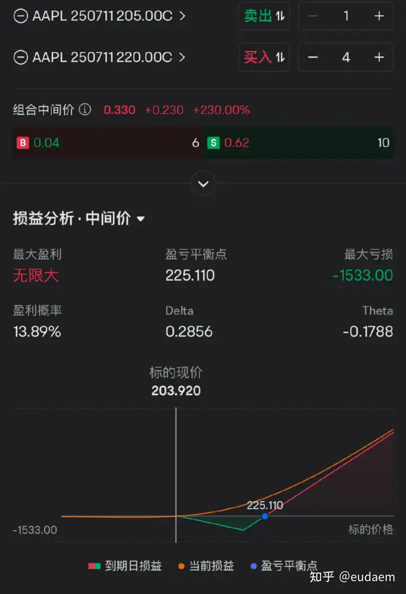

### 有什么期权交易策略能够稳赚不赔的2

几乎不存在稳赚不赔的策略，每种策略都需要一个假设，如果市场不按照你的预期走，那就得亏钱，但为什么说几乎呢？是因为确实存在一种套利策略盒式套利，通过这种期权组合可以赚取无风险利率就是美债收益率，美股有一个ETF叫BOXX就是做这个策略的，不过直接买美债也行，如果自己手动组合手续费比较高，建议直接BOXX，此外，还有几个个人认为不错的策略(但有风险):

1. **轮式策略**

选一个好股票，比如GOOG or AAPL，支撑位卖put，万一被行权了持股反手卖成本价call，这样时间拉长来看肯定能赚钱的

2. **卖铁鹰**，也就是卖虚值call 虚值put，两边再买入更虚的call和put对尾部风险进行保护，相当于卖strangle，买更宽的strangle

3. **对角价差 diagonal spread**

如果是上涨趋势，可以做对角价差，低iv时买入远期平值call，吃delta收益和正vega收益，同时iv很高时卖近期的虚值call，吃iv crush的负vega收益，建议选择一周的时间间隔，theta decay比较快，快要行权的时候去移仓，delta尽量小一点以免被行权，个人喜欢0.15左右，行权概率较低，发财报前一般能卖个好价格，操作的好的话可以把买远期call的成本降到0，相当于免费获得了一张call，或者说以零成本获得100股正股一段时间内的正向收益，不过当然有风险，就是单边下跌，但是要赚钱就得带一点大致的方向判断，方向性风险如果都对冲掉了就赚不到什么钱了。下跌趋势同理，call换成put就行，如果看不清方向，判断要么大涨要么大跌，可以做双向的对角，不做方向判断，相当于买了straddle，不断卖近期strangle降低买入straddle的成本，也就是逐渐把盈亏平衡的范围缩小，涨跌都能赚

4. **领式策略 collar**

持有正股，卖出call，以备行权，收权利金，买入put对冲下跌风险

5. **反向比率价差策略 Reverse Ratio Spread**

分看涨看跌，看涨的话，简单来说就是卖出低strike call，获得权利金，然后顺着期权链往上找，找到一个权利金为低strike整数倍的call买入，差不多就行，不用太精确，比如低strike call 10块钱，就找个权利金大概为5的，那么就是买2张，2.5就是4张，不能太虚，太虚行权概率极小，手续费也高，盈亏曲线长这样

这个好处是初始建仓成本为零，因为是用获得的权利金去买call，下跌零亏损(不考虑手续费)，大涨能赚很多，但是小涨亏钱(概率最大)，所以重点还是对市场判断是否准确，风险还是有的，个人觉得可以拿来押财报大涨，下跌了没有任何损失，但是上涨不及预期就得亏钱。看跌同理，call换成put就行。另外"赌狗"押财报一般使用straddle或者strangle，或者直接梭单腿call put，具体怎么做还得看自己的喜好

6. **风险反转 risk reversal**

比如某只股票大跌，但你觉得基本面没有问题，终究会涨回去，而且筑底反弹，你可以卖支撑位的put，用获得的权利金去买一个虚值call，这样净建仓成本是0，等股价反弹，虚值call变成价内，相当于0成本抄底。不过风险就是继续下跌被行权，但是你看好这个股票的话，可以继续持有或者转做wheel策略

7. **delta中性策略**，也就是gamma scalping，做市商的玩法，通过不断对冲delta保持delta中性，赚二阶偏导的钱，不过需要会写程序，只有在高波动的情况下才能赚到钱，直观一点的话，赚的就是凸性的钱，你需要为市场预期凸性(iv)付出权利金，实际的凸性(rv)高于iv就能赚钱

以上不构成投资建议，稳赚不赔只有BOXX，以及卖深度虚值期权(行权概率极小极小的那种，但是赚不了几个钱当然)，或者利用程序捕捉定价错误套利，额外分享的几个是我觉得不错的策略，但是各有各的风险，使用需谨慎，祝各位发财

作者：eudaem
链接：https://www.zhihu.com/question/589532887/answer/1913912697038312025
来源：知乎
著作权归作者所有。商业转载请联系作者获得授权，非商业转载请注明出处。