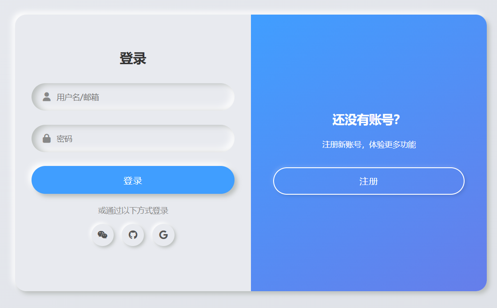

## 纯 HTML 静态版：立体阴影登录 / 注册双面板

### 核心保留效果 

1. 双层 box-shadow 实现的立体浮雕 / 凹陷质感；

2. 登录 / 注册面板左右滑动切换动画；

3. 按钮、输入框、社交图标的交互反馈（hover/active 态）；

4. 原文的渐变背景、布局和视觉层级。

   ​	[在线查看](https://m3u8player.com.cn/htmlcss/%E7%AB%8B%E4%BD%93%E9%98%B4%E5%BD%B1%E7%99%BB%E5%BD%95.html)

   

```html
<!DOCTYPE html>
<html lang="zh-CN">
<head>
  <meta charset="UTF-8">
  <meta name="viewport" content="width=device-width, initial-scale=1.0">
  <title>立体阴影登录注册双面板（纯HTML静态版）</title>
  <!-- 引入Font Awesome图标（原文用到的社交图标） -->
  <link rel="stylesheet" href="https://cdn.bootcdn.net/ajax/libs/font-awesome/6.4.0/css/all.min.css">
  <style>
    /* 全局样式重置 + 基础配置 */
    * {
      margin: 0;
      padding: 0;
      box-sizing: border-box;
      font-family: "Poppins", "Microsoft Yahei", sans-serif;
    }
    body {
      /* 原文的渐变背景 */
      background: linear-gradient(145deg, #e8eaef 0%, #dde0e6 100%);
      min-height: 100vh;
      display: flex;
      justify-content: center;
      align-items: center;
      padding: 20px;
    }

    /* 表单容器：核心立体阴影 + 相对定位（承载两个面板） */
    .container {
      position: relative;
      width: 100%;
      max-width: 850px;
      height: 500px;
      background: #e8eaef;
      /* 双层外阴影：打造立体凸起效果 */
      box-shadow: 5px 5px 8px #babebc, -5px -5px 10px #fff;
      border-radius: 20px;
      overflow: hidden;
    }

    /* 表单面板通用样式 */
    .form-panel {
      position: absolute;
      top: 0;
      width: 50%;
      height: 100%;
      padding: 40px 30px;
      display: flex;
      flex-direction: column;
      justify-content: center;
      transition: all 0.6s ease-in-out;
    }

    /* 左侧面板（默认登录面板） */
    .left-panel {
      left: 0;
      z-index: 2;
    }
    /* 右侧面板（默认注册面板，初始偏移） */
    .right-panel {
      right: 0;
      z-index: 1;
      opacity: 0;
      transform: translateX(20%);
    }

    /* 切换后：登录面板右移+透明，注册面板显示 */
    .container.active .left-panel {
      transform: translateX(-20%);
      opacity: 0;
      z-index: 1;
    }
    .container.active .right-panel {
      transform: translateX(0);
      opacity: 1;
      z-index: 2;
    }

    /* 表单标题 */
    .form-title {
      font-size: 24px;
      font-weight: 600;
      color: #333;
      margin-bottom: 30px;
      text-align: center;
    }

    /* 输入框：核心内层inset阴影（凹陷效果） */
    .input-group {
      position: relative;
      margin-bottom: 25px;
    }
    .input-field {
      width: 100%;
      height: 50px;
      background: #e8eaef;
      border: none;
      outline: none;
      padding: 0 20px;
      padding-left: 45px;
      border-radius: 25px;
      /* 内层阴影：凹陷质感 */
      box-shadow: inset 7px 2px 10px #babebc, inset -5px -5px 12px #fff;
      font-size: 14px;
      color: #555;
    }
    /* 输入框图标 */
    .input-icon {
      position: absolute;
      left: 20px;
      top: 50%;
      transform: translateY(-50%);
      color: #888;
      font-size: 16px;
    }

    /* 按钮：立体阴影 + 按压反馈 */
    .btn {
      width: 100%;
      height: 50px;
      border: none;
      outline: none;
      border-radius: 25px;
      font-size: 16px;
      font-weight: 500;
      cursor: pointer;
      transition: all 0.3s ease;
      text-transform: uppercase;
      letter-spacing: 1px;
    }
    /* 提交按钮：立体凸起 */
    .submit-btn {
      background: #409eff;
      color: #fff;
      /* 外层阴影：凸起 */
      box-shadow: 5px 5px 8px #babebc, -5px -5px 10px #fff;
    }
    /* 点击按压：切换为内层阴影（凹陷） */
    .submit-btn:active {
      box-shadow: inset 5px 5px 8px #2b7dcc, inset -5px -5px 10px #55b1ff;
    }

    /* 切换提示面板（中间渐变层） */
    .toggle-panel {
      position: absolute;
      top: 0;
      left: 50%;
      width: 50%;
      height: 100%;
      background: linear-gradient(145deg, #409eff, #667eea);
      border-radius: 0 20px 20px 0;
      color: #fff;
      display: flex;
      flex-direction: column;
      justify-content: center;
      align-items: center;
      text-align: center;
      padding: 0 40px;
      transform: translateX(0);
      transition: all 0.6s ease-in-out;
      z-index: 10;
    }
    /* 切换后：提示面板左移 */
    .container.active .toggle-panel {
      transform: translateX(-100%);
      border-radius: 20px 0 0 20px;
    }

    /* 提示面板文本 */
    .toggle-title {
      font-size: 22px;
      font-weight: 600;
      margin-bottom: 20px;
    }
    .toggle-desc {
      font-size: 14px;
      line-height: 1.6;
      margin-bottom: 30px;
    }
    /* 切换按钮：浅色立体样式 */
    .toggle-btn {
      background: transparent;
      border: 2px solid #fff;
      color: #fff;
      box-shadow: 3px 3px 6px rgba(0,0,0,0.1), -3px -3px 6px rgba(255,255,255,0.1);
    }
    .toggle-btn:active {
      box-shadow: inset 3px 3px 6px rgba(0,0,0,0.1), inset -3px -3px 6px rgba(255,255,255,0.1);
    }

    /* 社交登录区域 */
    .social-container {
      margin: 20px 0;
      text-align: center;
    }
    .social-title {
      font-size: 14px;
      color: #888;
      margin-bottom: 15px;
    }
    .social-icons {
      display: flex;
      justify-content: center;
      gap: 15px;
    }
    .social-icon {
      width: 40px;
      height: 40px;
      border-radius: 50%;
      background: #e8eaef;
      box-shadow: 3px 3px 6px #babebc, -3px -3px 6px #fff;
      display: flex;
      justify-content: center;
      align-items: center;
      color: #555;
      cursor: pointer;
      transition: all 0.3s ease;
    }
    .social-icon:active {
      box-shadow: inset 3px 3px 6px #babebc, inset -3px -3px 6px #fff;
      color: #409eff;
    }

    /* 移动端适配：768px以下 */
    @media (max-width: 768px) {
      .container {
        height: auto;
        max-width: 400px;
      }
      /* 面板改为上下排列，取消左右切换 */
      .form-panel {
        width: 100%;
        height: auto;
        position: relative;
        padding: 30px 20px;
      }
      .right-panel {
        opacity: 0;
        transform: translateY(20%);
        position: absolute;
        top: 0;
        left: 0;
      }
      .container.active .left-panel {
        transform: translateY(-20%);
      }
      .container.active .right-panel {
        transform: translateY(0);
      }
      /* 切换提示面板改为底部 */
      .toggle-panel {
        width: 100%;
        height: auto;
        left: 0;
        top: auto;
        bottom: 0;
        padding: 20px;
        border-radius: 0 0 20px 20px;
      }
      .container.active .toggle-panel {
        transform: translateY(0);
        border-radius: 20px 20px 0 0;
        top: 0;
        bottom: auto;
      }
    }
  </style>
</head>
<body>
  <!-- 表单容器：active类控制面板切换 -->
  <div class="container" id="formContainer">
    <!-- 左侧面板：登录 -->
    <div class="form-panel left-panel">
      <h2 class="form-title">登录</h2>
      <form id="loginForm">
        <div class="input-group">
          <i class="fas fa-user input-icon"></i>
          <input type="text" class="input-field" placeholder="用户名/邮箱" required>
        </div>
        <div class="input-group">
          <i class="fas fa-lock input-icon"></i>
          <input type="password" class="input-field" placeholder="密码" required>
        </div>
        <button type="submit" class="btn submit-btn">登录</button>
      </form>
      <div class="social-container">
        <p class="social-title">或通过以下方式登录</p>
        <div class="social-icons">
          <i class="fab fa-weixin social-icon"></i>
          <i class="fab fa-github social-icon"></i>
          <i class="fab fa-google social-icon"></i>
        </div>
      </div>
    </div>

    <!-- 右侧面板：注册 -->
    <div class="form-panel right-panel">
      <h2 class="form-title">注册</h2>
      <form id="signupForm">
        <div class="input-group">
          <i class="fas fa-user input-icon"></i>
          <input type="text" class="input-field" placeholder="用户名" required>
        </div>
        <div class="input-group">
          <i class="fas fa-envelope input-icon"></i>
          <input type="email" class="input-field" placeholder="邮箱" required>
        </div>
        <div class="input-group">
          <i class="fas fa-lock input-icon"></i>
          <input type="password" class="input-field" placeholder="密码" required>
        </div>
        <button type="submit" class="btn submit-btn">注册</button>
      </form>
      <div class="social-container">
        <p class="social-title">或通过以下方式注册</p>
        <div class="social-icons">
          <i class="fab fa-weixin social-icon"></i>
          <i class="fab fa-github social-icon"></i>
          <i class="fab fa-google social-icon"></i>
        </div>
      </div>
    </div>

    <!-- 切换提示面板 -->
    <div class="toggle-panel">
      <h2 class="toggle-title" id="toggleTitle">还没有账号？</h2>
      <p class="toggle-desc" id="toggleDesc">注册新账号，体验更多功能</p>
      <button class="btn toggle-btn" id="toggleBtn">注册</button>
    </div>
  </div>

  <script>
    // 原生JS实现交互逻辑
    document.addEventListener('DOMContentLoaded', () => {
      // 1. 获取核心元素
      const formContainer = document.getElementById('formContainer');
      const toggleBtn = document.getElementById('toggleBtn');
      const toggleTitle = document.getElementById('toggleTitle');
      const toggleDesc = document.getElementById('toggleDesc');
      const loginForm = document.getElementById('loginForm');
      const signupForm = document.getElementById('signupForm');

      // 2. 面板切换逻辑
      let isRegisterMode = false;
      toggleBtn.addEventListener('click', () => {
        // 切换容器active类（控制样式）
        formContainer.classList.toggle('active');
        // 切换文本和按钮文字
        if (isRegisterMode) {
          // 切换为登录提示
          toggleTitle.textContent = '还没有账号？';
          toggleDesc.textContent = '注册新账号，体验更多功能';
          toggleBtn.textContent = '注册';
        } else {
          // 切换为注册提示
          toggleTitle.textContent = '已有账号？';
          toggleDesc.textContent = '登录你的账号，继续使用服务';
          toggleBtn.textContent = '登录';
        }
        isRegisterMode = !isRegisterMode;
      });

      // 3. 表单提交逻辑（静态版仅做提示）
      loginForm.addEventListener('submit', (e) => {
        e.preventDefault(); // 阻止默认提交
        alert('登录表单提交成功（静态版仅做演示）');
        loginForm.reset(); // 重置表单
      });

      signupForm.addEventListener('submit', (e) => {
        e.preventDefault(); // 阻止默认提交
        alert('注册表单提交成功（静态版仅做演示）');
        signupForm.reset(); // 重置表单
      });

      // 4. 社交图标点击提示
      const socialIcons = document.querySelectorAll('.social-icon');
      socialIcons.forEach(icon => {
        icon.addEventListener('click', () => {
          const iconName = icon.classList[1].split('-')[2]; // 获取图标名称（weixin/github/google）
          alert(`你点击了${iconName === 'weixin' ? '微信' : iconName === 'github' ? 'GitHub' : 'Google'}登录/注册`);
        });
      });
    });
  </script>
</body>
</html>
```

## 关键改动说明（从 Vue 版→纯 HTML 静态版）

### 1. 移除 Vue 依赖，用原生 JS 实现交互

|        Vue 3 特性         |                       原生 JS 替代方案                       |
| :-----------------------: | :----------------------------------------------------------: |
| `ref(isRightPanelActive)` | 用`classList.toggle('active')`控制容器类名，结合 CSS 实现面板切换 |
|         `v-model`         | 保留原生表单`input`，提交时通过`e.preventDefault()`阻止默认行为 |
|      组合式 API 函数      | 用`addEventListener`绑定点击 / 提交事件，实现面板切换和表单处理 |

### 2. 核心视觉效果完整保留

- **双层 box-shadow**：外层`box-shadow: 5px 5px 8px #babebc, -5px -5px 10px #fff`实现凸起；内层`inset`阴影实现输入框凹陷；
- **切换动画**：通过`.container.active`类控制面板的`transform`和`opacity`，实现平滑滑动；
- **按压反馈**：按钮 / 图标`active`伪类切换阴影为`inset`，模拟按压凹陷；
- **渐变背景**：切换提示面板保留`linear-gradient(145deg, #409eff, #667eea)`渐变。

### 3. 新增移动端适配（原文未提及）

- 768px 以下屏幕：面板从「左右排列」改为「上下排列」，切换提示面板移到底部 / 顶部；
- 适配小屏幕触控体验，避免横向空间不足导致的布局错乱。

------

## 运行与验证

1. 复制代码保存为`.html`文件，直接用浏览器打开；

2. 核心交互验证：

   - 点击「注册 / 登录」按钮，面板平滑切换，文本同步更新；
   - 输入框有凹陷立体效果，按钮点击有按压反馈；
   - 提交表单弹出提示（静态版仅演示，无实际接口请求）；
   - 社交图标点击弹出对应提示；

   

3. 移动端验证：缩小浏览器窗口到 768px 以下，布局自动适配为上下结构。

------

### 总结

1. **核心保留**：原文的 CSS3 立体阴影视觉效果、面板切换动画、交互反馈全部完整保留；
2. **技术替换**：用原生 JS+CSS 类名切换替代 Vue 3 的响应式状态，无框架依赖，可直接部署；
3. **额外优化**：新增移动端适配，提升多端兼容性；
4. **使用场景**：可直接作为静态登录 / 注册页面使用，如需对接后端，只需修改表单提交逻辑（添加`fetch`/`axios`请求接口）。

如果需要对接后端接口，只需修改`loginForm`/`signupForm`的`submit`事件，将`alert`替换为真实的接口请求即可，比如：

```javascript
// 示例：登录表单对接后端接口
loginForm.addEventListener('submit', async (e) => {
  e.preventDefault();
  const formData = new FormData(loginForm);
  const data = Object.fromEntries(formData.entries());
  try {
    const res = await fetch('/api/login', {
      method: 'POST',
      headers: { 'Content-Type': 'application/json' },
      body: JSON.stringify(data)
    });
    const result = await res.json();
    if (result.code === 200) {
      alert('登录成功！');
      // 跳转到首页
      window.location.href = '/index.html';
    } else {
      alert('登录失败：' + result.msg);
    }
  } catch (err) {
    alert('网络错误，请重试！');
  }
});
```

