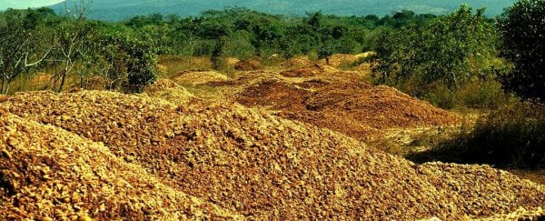
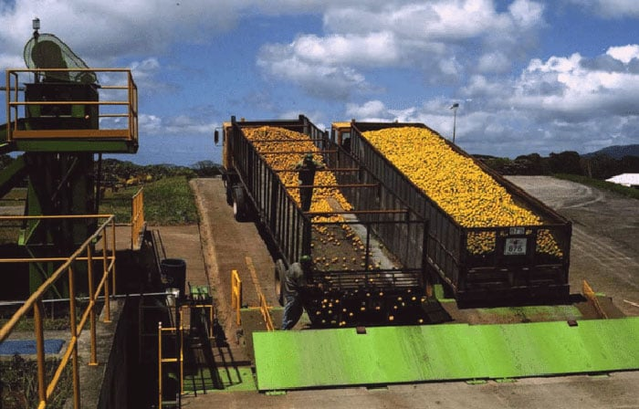
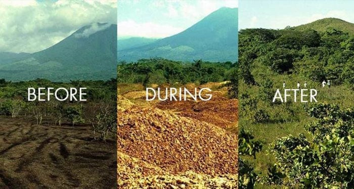
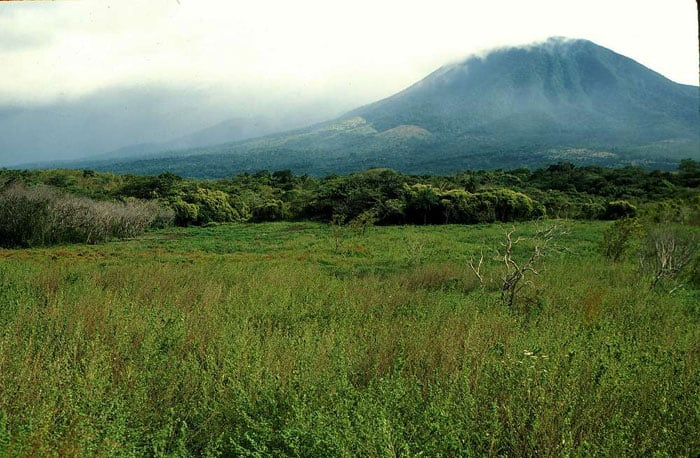

### 绿化荒山的简单方法

[原文链接](https://www.sciencealert.com/how-12-000-tonnes-of-dumped-orange-peel-produced-something-nobody-imagined)

# 12,000吨被倾倒的橙皮如何发展成无人预料的景观

[环境](https://www.sciencealert.com/environment)2017年8月30日

作者[彼得·多克里尔](https://www.sciencealert.com/peter-dockrill)

一个曾被遗弃、几乎被遗忘的实验性保护项目，在构思近二十年后，终于取得了惊人的生态胜利。

该计划曾在1990年代中期，一家果汁公司将1000车废弃橙皮倾倒在哥斯达黎加一片荒芜的牧场，最终使这片荒凉的土地焕发了繁荣茂盛的森林。

这是一个极大的转折，尤其是该项目仅在第二年就被迫关闭——尽管提前取消，已在3公顷（7英亩）场地上沉积的剥皮使地面生物质增长了176%。

普林斯顿大学[生态学家蒂莫西·特鲁尔说](https://www.princeton.edu/news/2017/08/22/orange-new-green-how-orange-peels-revived-costa-rican-forest)：“这是我听说过的少数可以实现成本为零的碳封存案例之一。”

“这不仅仅是公司和当地公园的双赢——对所有人来说都是双赢。”

该计划诞生于1997年，当时普林斯顿大学的研究员丹尼尔·詹岑和温妮·哈尔瓦克斯向哥斯达黎加橙汁制造商Del Oro提出了一个独特的机会。

如果Del Oro同意将其毗邻[瓜纳卡斯特保护区](https://en.wikipedia.org/wiki/Guanacaste_Conservation_Area)的部分土地捐赠给国家公园，公司将被允许免费将其丢弃的橙皮倾倒在公园内退化的土地上。

果汁公司同意了这笔交易，约12,000吨废橙皮由一千卡车车队运输，被无情地倾倒在几乎死气沉沉的土地上。

大量富含养分的有机废弃物几乎瞬间影响了土地的肥力。

“大约六个月后，橙皮已经从橙皮转化成厚厚的黑色壤土，”特鲁尔告诉[*《科学美国人*](https://www.scientificamerican.com/podcast/episode/a-fruitful-experiment-in-land-conservation/?print=true)》。

“有点像是在穿过一个肮脏的阶段，夹杂着那些充满苍蝇幼虫的泥泞物。”

尽管开局有希望，但保护实验未能持久，竞争对手TicoFruit起诉Del Oro，[指控](https://www.princeton.edu/news/2017/08/22/orange-new-green-how-orange-peels-revived-costa-rican-forest)其竞争对手“亵渎了一个国家公园”。

哥斯达黎加最高法院支持了TicoFruit，这项雄心勃勃的实验被迫终止，该网站在接下来的15年里基本被遗忘。

随后，2013年，特鲁尔在访问哥斯达黎加进行其他研究时，决定对该遗址进行评估。

事实证明，唯一的问题其实是找到这片曾经的荒地——这场荒原旱的景观彻底变成了茂密、藤蔓茂密的丛林，这让他不得不两次前往现场。

“那块六英尺长、用鲜黄色字体标示该地点的招牌，藤蔓丛生得太严重，我们直到多年后才发现它，”Treuer告诉《[*Popular Science*](http://www.popsci.com/food-waste-fertilizer)》，“经过数十次实地考察后。”

当将该地点与附近未用橙皮处理的对照区进行比较时，Treuer团队发现他们的实验堆肥堆土壤更肥沃，树木生物量更多，树种种类更丰富——包括一棵巨大的无花果树，[树干需要三个人](http://www.popsci.com/food-waste-fertilizer#page-2)一起环绕才能覆盖整个树干。

至于橙皮如何在短短16年的隔离中如此有效地恢复遗址，没有人完全确定。

“这是我们尚未得到答案的百万美元问题，”特鲁尔告诉[*《大众科学*](http://www.popsci.com/food-waste-fertilizer)》。

“我强烈怀疑，抑制入侵草与重度退化土壤的恢复之间存在某种协同效应。”

虽然具体机制目前仍有些神秘，研究人员希望这座废弃的16年橙皮垃圾场的巨大成功能激励其他类似的保护项目。

尤其是因为，除了处理废弃物和振兴贫瘠景观的双重优势外，更丰富的林地还能从大气中[吸收更多碳](https://www.sciencealert.com/the-world-is-getting-greener-thanks-to-rising-carbon-dioxide-levels)——这意味着像这样小块再生土地最终可能帮助拯救地球。

“真遗憾，我们生活在一个营养有限、退化生态系统和富含养分的废弃物流的世界。我们希望这些事情能稍微融合起来，“特鲁尔告诉《[*科学美国人*](https://www.scientificamerican.com/podcast/episode/a-fruitful-experiment-in-land-conservation/?print=true)》。

“这并不是任何农业公司随意将废弃物倾倒在保护区的许可，但这意味着我们应该开始思考如何进行深思熟虑的实验，看看在他们的系统中是否能实现类似的三赢效果。”

这些发现发表在[*《恢复生态学*](http://onlinelibrary.wiley.com/doi/10.1111/rec.12565/full)》杂志上。