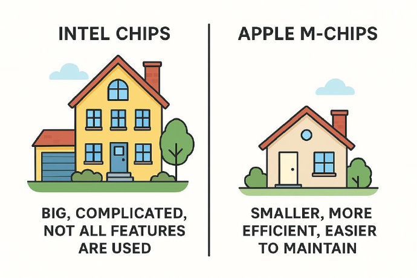
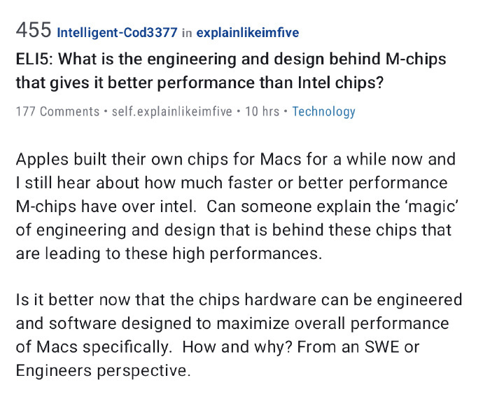
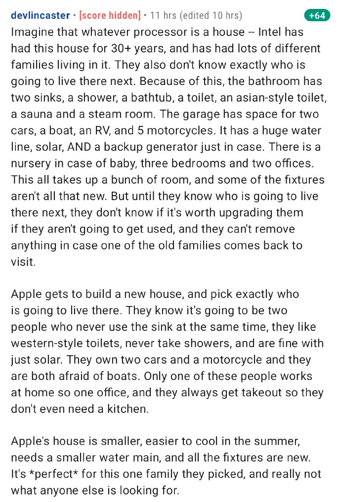

### 苹果M芯片到底强在哪？一个“盖房子”的比喻让你秒懂

很多科技爱好者和普通用户都注意到，自从苹果公司开始为 Mac 电脑设计自己的 M 系列芯片以来，其性能和能效表现似乎总能超越同期的英特尔芯片。这背后究竟隐藏着怎样的工程与设计“魔法”？难道仅仅是因为硬件和 软件可以专门为 Mac 进行优化吗？
Reddit 论坛上有位用户用一个非常绝妙的“盖房子”的比喻，通俗易懂地解释了两者之间的根本差异。
想象一下，我们把处理器（processor）比作一栋房子。
英特尔的房子，是一栋有着30多年历史的老宅。
在这漫长的岁月里，无数个不同的家庭曾在这里居住。因此，英特尔并不知道下一个住进来的会是谁。为了满足所有潜在客户的需求，这栋房子必须面面俱到：
• 卫生间里有两个洗手池、一个淋浴、一个浴缸，甚至还有桑拿房和汗蒸房。
• 车库巨大无比，可以停两辆轿车、一艘船、一辆房车，外加五辆摩托车。
• 供电系统极其复杂，不仅有巨大的主水管、太阳能，还配备了备用发电机，以防万一。
• 房子里有婴儿房（万一有新生儿）、三间卧室和两间办公室。
所有这些房间和设施占用了大量空间，而且其中一些装修已经很旧了。但在不确定下一任房客是否会用上这些东西之前，英特尔不敢轻易升级它们。更要命的是，为了照顾那些可能回来探亲的“老住户”（保持向后兼容性），这些老旧的东西还不能随便拆。
而苹果公司呢，则是为一位特定的客户从零开始盖一栋全新的房子。
苹果非常清楚，即将住进来的这个家庭是什么样的：
• 他们是两个人，习惯了现代西式的生活方式，从不同时使用水槽。
• 他们不喜欢泡澡，只喜欢淋浴。
• 他们环保，只需要太阳能就足够了。
• 他们有两辆车和一辆摩托车，但都非常害怕船。
• 家里只有一个人需要在家办公，所以一间办公室就够了。
• 最特别的是，他们从不做饭，总是点外卖，所以连厨房都可以不要。
结果显而易见。
苹果的房子面积更小，夏天更容易降温（功耗低、散热好），所需的主水管更细（内存统一架构效率高），而且所有设施都是崭新的（最新的制程和架构）。
这栋房子对于苹果选定的这一家人来说是完美的，但对于其他人来说，可能完全不合适。
这个比喻生动地揭示了两者设计的核心理念差异：
• 英特尔 需要制造通用芯片，卖给戴尔、惠普、联想等所有PC厂商，还要支持 Windows、Linux 等多种操作系统，并确保几十年前的老 软件依然能运行。这就像是建造一个功能齐全但冗余繁杂的公共公寓。
• 苹果 则采用垂直整合的模式，芯片、硬件、操作系统（macOS）全都自己设计。他们可以精确地知道自己的软件需要什么样的硬件功能，从而进行“量身定制”，砍掉一切不必要的部分，将资源用在刀刃上，最终实现了性能和能效的巨大飞跃。

