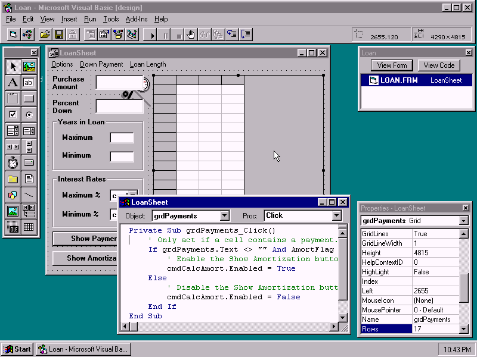
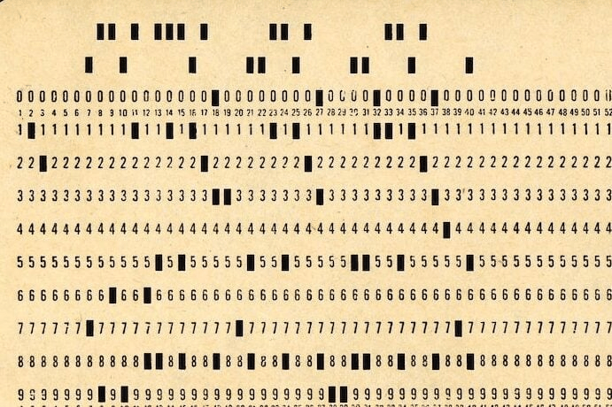
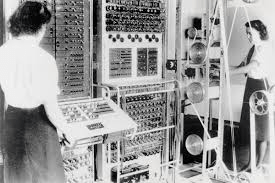

### 软件开发的未来是软件开发者

[原文地址](https://codemanship.wordpress.com/2025/11/25/the-future-of-software-development-is-software-developers/)

我作为一名计算机程序员已经有43年经验。这占了电子可编程计算机历史的一半以上。

在这段时间里，我见证了很多变化。但我也见过有些东西几乎没变。

我经历过几次技术时代，当时被称为“计算机程序员的终结”。

所见即所得，像Visual Basic和Delphi这样的拖放编辑器将终结对程序员的需求。

Microsoft Office 中的向导和宏将终结对程序员的需求。

可执行UML将终结对程序员的需求。

无代码和低代码平台将终结对程序员的需求。

而现在，我每天都看到大型语言模型将终结对程序员的需求。

这些周期并不新鲜。在1970年代和1980年代，4GL和5GL被视为程序员的终结。

在他们之前，还有像Fortran和COBOL这样的三代语言。

在他们之前，像A-0这样的编译器将终结那些通过在卡片上打孔来指导计算机的程序员的需求。

但如果我们考虑电子可编程计算机最早（机密的）起点，情况更早。其中第一台COLOSSUS是通过物理重新接线编程的。

也许那些参与那台机器的工程师嘲笑那些在最早的存储程序计算机上工作的人不是“*真正的*程序员”。

每一次周期中，预测都被证明非常非常错误。最终结果不是程序员减少，而是程序和*程序*员*数量增加*。这是每年价值1.5万亿美元的[杰文斯悖论](https://en.wikipedia.org/wiki/Jevons_paradox)案例。

我们又回到了另一个循环。

“但这次不一样，杰森！”

是的，确实如此。规模与以往周期不同。我不记得在全国性报纸封面上看到过关于Visual Basic或可执行UML的宣传。我不记得见过整个经济体都在押注4GL。

还有一个重要区别：在之前的周期中*，这项技术**运行得很可靠*。我们真的可以通过VB或Microsoft Access更快生产可用的软件。事实证明，LLMs并非如此，对大多数团队来说，LLM实际上会拖慢速度，同时使软件更不可靠且更难维护。大多数情况下这是一种双输局面。（除非这些团队已经解决了[开发过程中的真正瓶颈](https://codemanship.wordpress.com/2025/10/30/the-ai-ready-software-developer-index/)。）

但这些都是学术上的。即使这项技术真的为更多团队带来了积极影响，也不意味着我们不再需要程序员。

计算机编程的难点不是用代码表达我们希望机器做什么。难点在于将人类思维——其中充满模糊、模糊和矛盾——转化为逻辑精确且无歧义的*计算思维*，并能用编程语言的语法形式表达。

当程序员在卡片上打孔时，这才是最难的部分。最难的是他们输入COBOL代码的时候。最难的是他们让Visual Basic图形界面活起来（大概是为了追踪凶手的IP地址）。而当他们要求语言模型预测看起来合理的Python时，这才是最难的部分。

难点一直是——而且很可能未来很多年都会是*——准确知道*该提出什么要求。

埃德加·戴克斯特拉近[50年前](https://www.cs.utexas.edu/~EWD/transcriptions/EWD06xx/EWD667.html)就说过：我们永远不会用英语、法语或西班牙语编程。自然语言的发展还不够精确和明确。语义模糊和语言熵总会破坏这一雄心。

虽然几乎任何人都能学会这样思考，但不是每个人都会喜欢，也不是每个人都擅长。喜欢的人和喜欢的人的需求永远会超过供应。

*尤其是*如果企业像最近这样停止招聘和培训几年。但这些繁荣与萧条的周期在我的职业生涯中也是一个常见现象。这次恰好正好赶上了科技炒作周期，给人提供了一个方便的借口。

没有可信的证据表明“人工智能”正在大量取代软件开发者。疫情期间的过度招聘、借贷成本上升以及数据中心的淘金热分散了大量资金，这些因素共同承担了主要工作。

而且没有理由相信“人工智能”会很快进化到能够完成人类程序员必须做的事——理解、推理和学习——的地步。通用人工智能似乎依然遥不可及，而计算机编程的难点确实需要通用智能。

除此之外，“人工智能”编码助手和以往的编译器和代码生成器根本不同。完全相同的提示音很可能不会产生完全相同的程序。生成的代码几乎肯定会有真正的程序员需要识别和解决的问题。

当我写代码时，我是在脑海中执行它。我对程序的内部模型不仅仅是语法上的，不像大型语言模型那样。我不仅仅是匹配模式和预测符号以生成统计上合理的代码。我实际上*理解*代码。

甚至高管也注意到，关于该公司代码中有多少是“人工智能生成”的夸张说法，导致重大故障和事件之间的关联。

许多人现在声称“提示是新的源代码”，甚至认为整个工作系统可以从原始模型输入中重生，这种荒谬的事实将被揭露为荒谬。与现实辩论的问题在于，现实总是会赢。（甚至没意识到自己在辩论中。）

所以，不，“人工智能”并不是程序员的终结。我甚至不确定，1到3年后，这场狂热是否已经随着计数员的最终比分而逐渐消退。而且*他们总是*赢。

对于那些说这项技术不会消失的人，我想提醒他们，这些模型的制造成本有多高，以及它们正在承受的巨大损失。是的*，你可以继续*使用本地的某个小型模型实例，这些模型是从今天训练好的超大规模模型提炼出来的。但随着时间推移，你可能会发现无法从它训练的编程语言和库版本中转动，会有些限制。

因此，我对超大规模大型语言模型的长期可持续性持怀疑态度。它们是“人工智能”的阿波罗登月任务。最终，很可能根本不值得。也许我们会去参观他们数据中心可能成为的博物馆？

可预见的软件开发未来，可能会使用“人工智能”——以更为谦逊的形式（例如基于基础语言模型构建的Java编码助手）来生成原型，甚至用于生产代码的内联完成等小任务。

但在关键时刻，*总会*有软件开发人员在掌舵。如果相信杰文斯的话，可能我们中*更多*人。

雇主们，如果我是你们，我可能会现在开始招聘，赶在大家从这场发烧梦中醒来时抢先一步。

如果你有兴趣让他们掌握技术实践，这些技术可以大幅缩短交付周期，同时提升可靠性并降低变更成本，无论是否使用“AI”，都可以联系我。这真是三赢。