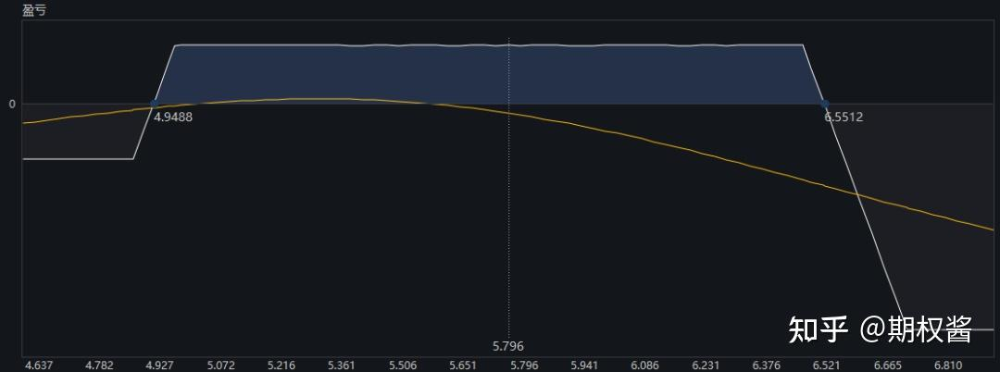
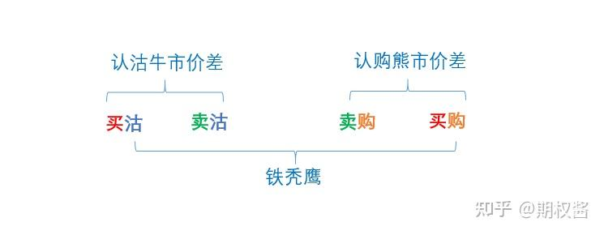

## 铁秃鹰：一个适合散户稳赢的期权策略

最近把Michael Benklifa的小册子《Profiting With Iron Condor Options》刷了两遍（他的《Think Like an Option Trader》可能更为人熟知）。

Michael的这本小册子全篇只围绕一个期权策略做阐述，即“卖出铁秃鹰（Sell Iron Condor Options）”。我这篇笔记就来做个肤浅的总结。另外提醒一点，不要看中文翻译版。

**1、铁秃鹰策略简介**

我接触过很多期权策略，它们试图在Delta，Vega，Gamma以及Theta多个维度上赚钱。典型的“既要…又要…还要”。交易目的越多，策略本身就越脆弱，风控也更加困难。

铁秃鹰策略只从Theta中获利，且，“不动”是最主要的操作。这很适合散户。散户的资金量小，期权的交易费用占比就较大，因此散户不适合做日内或高频。对于上班族更没有这个精力。铁秃鹰组合构建后，除了触发风控阈值后进行调整以外，大部分时间都是“不动”的状态。就好像一只长时间滑翔的秃鹰，只有机会来临时才会出击。

一个铁秃鹰组合有四腿：卖出虚值的认购、买入更高行权价的认购、卖出虚值的认沽、买入更低行权价的认沽。这四腿的到期日是一样的。

举个例子，以2021年2月19日沪市300ETF（510300.SH）收盘数据为基础，做一个6月23日到期的铁秃鹰：买入6750购1份，卖出6500购一份，卖出5000沽一份，买入4900沽一份。得到的到期收益率曲线（白线）及实时收益率曲线（黄线）如下图所示。

上面的到期收益率曲线很像一只秃鹰。很显然，铁秃鹰策略就是一个卖方策略，且收益有限、亏损有限。它有点类似于卖宽跨，只不过两侧潜在的无限损失通过更宽的买方限制住了，当然潜在收益也变小了。

看上图，可以发现，铁秃鹰的右翼其实是认购熊市价差，左翼是认沽牛市价差，所以可以用价差策略来释放保证金，以扩大仓位。当然，也可以用中间的双卖组合来释放保证金。

下面我们详细阐述这个策略。下文中，会等价地使用“铁秃鹰”和“铁鹰”、“进入”和“开仓”、“退出”和“平仓”、“call”和“认购”、“put”和“认沽”这几对术语。

**2、铁秃鹰组合的构建**

构建一个铁秃鹰组合，最主要的两个参数是：到期日、每个腿的行权价。

下面是作者的一些建议。

**（1）铁鹰的到期日怎么设置？**

铁鹰的每一腿都是同月的。关于组合到期日的设置方式：**最好在1个半月以上。**

行权日越近，虚值合约的价格越小，想要获得足够的利润，那么铁鹰中双卖的行权价距离就不能太远。然而，太近的距离大大增加了负Gamma的风险。如果股价巨幅波动，Theta积累的利润会瞬间被Gamma吞噬。另外，到期日太近、双卖的行权价太近，这两点都会缩小调整铁鹰的空间，遇到突发行情很容易措手不及。到时以更高的价格买入平仓，会使得交易体验很差。

**（2）铁鹰的各腿行权价怎么设置？**

各腿行权价决定了铁鹰的大小：义务仓行权价之间是铁鹰的身体，义务仓之外是两翼。四腿的行权价同时决定了：双卖的行权价距离以及两边的价差。

作者建议，不管call还是put，**卖出的那一腿合约Delta绝对值在10附近，最好不要超过12。**Delta太低，利润不容易达到预期。Delta太高，双卖的行权距离过近，gamma的风险就提高了。另外一种设置方式，就是双卖的行权价距离大概在当下标的价格的20%左右，并且价格从中间偏离5%时开始调整铁鹰的一翼。

权利仓的行权价怎么设置？作者建议，**两侧的价差最好在1挡。**比如卖购行权价C1的合约，那么买购比C1高一档的合约，以此两合约作为铁鹰的右翼。左翼类似设置。价差太大，也就是买入的那一腿太虚，可能流动性会不太好。另外，相差一档，对冲效果也更好一点。

**（3）预期收益多少比较合适？**

设置铁鹰时，**两翼权利金价差的和，为整体组合保证金的20%左右比较合适，最好不要低于12%。**太低的话，获取利润的速度太慢，且平仓的费用也许会吞噬不少微薄的利润。

一般，我们按照上述3点设置的条件可以筛选出一些铁鹰组合，这些铁鹰或近或远、或小或大，没有好坏，全看各自交易偏好。风险偏好低的交易者偏好交易远一些、大一些的铁鹰；风险偏好高，想短期获利的交易者更偏好近一些、小一些的铁鹰。

**3、进入铁秃鹰交易**

铁秃鹰策略的操作很简单，就是建仓和平仓，最多有些或有的调整。那么，首先，什么时候建仓铁秃鹰呢？

其实，我们可以在任何时点去寻找符合第2节条件的铁秃鹰组合。我们可能找不到一个，那么就不交易了。我们也可能找出多个，那么根据自己的风险偏好选择是否进入其中之一。

作者还给出了下面的经验之谈以及一些小技巧。

**（1）避开换月期。**一般，一个行权期前后，买方会调仓移仓，远月的波动率会上去，因此建立铁鹰可以避开这些时期。

**（2）隐波脉冲时进入。**在低隐波时进入铁秃鹰，确实容易被升波行情打扰。因此，我们可以挑一些隐波脉冲的时点进入。比如，我们可以给标的的Vix序列计算布林线，当Vix突破布林线上轨时，表明隐波在近20个交易日上升幅度偏离2个标准差，在此处建仓铁秃鹰，对赌隐波后面回归均值。降波会加速达到我们的预期目标，但可欲不可求。

**（3）尽量不要在长假前进入。**像春节、国庆这样的长假，时间损耗是十分可观的，而且市场不交易，价格定格在那里。最为理想的是，时间流逝的同时消息面上又相当平稳。因此很多人会在长假前卖出铁秃鹰。而卖出策略都建立了负Gamma头寸。负Gamma是长假的最大杀手。假期积累的消息（不管正面还是负面的）可能相当可怕，会造成节后的低开或高开（比如2018年劳动节后开市，2020年春节后开市）。

实际上，买方会害怕权利金下降较快，反而会在假期前卖出平仓，时间的损耗可能在假期前就反应，那时候平仓铁秃鹰可能已经有额外收益。所以尽量不要在假期前卖出铁秃鹰，或者尽量在假期前买入平仓在持的铁秃鹰。

**（4）不要患得患失。**隐波上升时进入铁秃鹰，很有可能被进一步上升的隐波吞噬利润。但是，不要老是等隐波峰值时再进入。等待，是交易者消极的应对方式。特别是趋势性行情，我们的思路容易被单边的上涨或下跌引导，认为隐波会进一步上升，从而偏执地等待峰值出现。不过，往往不会如我们所愿。进入点没有最好的，进入自己的心理伏击区就可以建立头寸。

**4、退出铁秃鹰交易**

进入铁秃鹰其实没有刚性的规则，隐波的阶段性脉冲时点也不以我们的意志为转移。与之相对，“退出”则是铁秃鹰策略中最重要的操作。

关于退出策略，“不要赚最后一个铜板”这句老生常谈的话同样适用铁秃鹰。具体到一些原则，作者给出了下面几点建议。

**（1）首先，是利润比例。**我们在获得铁秃鹰预期收益的1/3，甚至1/4时，就可以视情形退出。拿得越久、据行权日越近，就越危险。获得可观的收益，并且不在头寸里久待，是最为理想的交易。

**（2）其次，是时间。**比较合理的退出时间点是距离行权日一个月左右。当然有些交易者反而喜欢进入1个月以内的铁秃鹰，以期通过更快的时间损耗在短时间内带来收益。这里最大的风险就是Gamma带来的风险。铁秃鹰的两个最大的敌人：负Gamma以及升波。我们可以利用升波进入交易，但是负Gamma的威胁是我们需要时刻保持警惕，它会在瞬间吞噬掉你。

**（3）最后，是盈亏平衡点。**我们要时刻监控我们的实时收益率曲线（注意，不是到期收益率曲线），观察它是向上平移、向下平移、左偏还是右偏。在进入盈利区域时，尽快落袋为安。如果市场超出我们的预期发展，那么可以及时在盈亏平衡点平仓掉（股票交易里的成本线平仓）。

**5、调整铁秃鹰**

其实，能不调整最好，达到预期收益后退出就行。调整必然需要成本。但是，在一些风控指标无法再让我们忽视时，调整也不得不进行。下面是一些建议。

**（1）以标的价格偏移为界：**上面说到过一种设置行权价的方式，就是双卖的距离大概为标的价格的20%，也就是标的价格距离两侧每一翼大概10%的距离。我们可以在标的价格距离某一翼5%以内时开始调整组合。

**（2）以Delta阈值为界：**我们进入铁秃鹰时，两翼的义务仓Delta在10左右。当其中一翼的Delta超过25甚至30时，就要引起我们的注意，可以考虑调整铁秃鹰风险暴露较大的那一翼。其实，所有的希腊字母都是波动率的体现，Delta也不例外，Delta大于30，除了位置逼近平值以外，市场恐慌加剧，也会提高Delta。此时，实时收益率曲线在往上移，铁秃鹰组合在亏损中。

**（3）某一翼的剩余价值很微小时：**当市场持续朝某一方向运动，那么另一方向的价值不断减少。因为最多归0，当另一翼价值太小的时候，我们也没有持有它的必要了。我们可以买入平仓，并且将这一翼往中间移仓。新的权利金价差也可以在一定程度上覆盖我们调整另一翼的成本。

**6. 一些误区和疑问梳理**

这一节，梳理一下交易铁秃鹰过程中的误区和疑问。有些误区的解释同样适用于交易其他期权策略。

**（1）隐波和标的价格波动是两回事**

隐波和短期内标的价格的涨跌幅关系不大。比如2020年7月初股市的暴涨，近月平值隐波一度涨到30%；然而1月初的这波上涨，隐波最高也只是摸到25%。隐波更多的是市场的情绪，和价格波动关系不大。

在一波上涨趋势中，隐波可能反而下降，说明交易者对趋势的持续性不看好。但如18年劳动节后的低开、2020年2月3日的低开，隐波暴涨。说明交易者一致看空后市下降趋势，大量买沽推高隐波。

**（2）所有的技术指标都不具有预测性**

像Vix这种工具，可以帮助我们设置交易时点，但不要假设它们具有预测性。所有指标都是滞后的，预测概率都是50/50的。

**（3）Delta和Gamma本质都是隐波的反应**

所有的希腊字母本质都是隐波的反应，不单单是Vega，Delta和Gamma也是隐波的反应。市场情绪起伏较大时，相同价值状态的Delta会升高，实时收益率曲线会上升。进一步讲，我们不管交易什么希腊字母，本质都是在交易市场的情绪。而良好的交易节奏，是抓住机会利用市场的短期恐慌和贪婪，而不是被市场情绪牵着鼻子走。

**（4）不要把降波作为交易目的**

有时候，我们进入在一个较高的隐波，那么降波将加速我们的利润获得，我们达到目的后要及时退出。首先，我们的初衷不是波动率交易，降波是运气，不能作为目的，不然铁鹰就变味了；其次，期待进一步降波是愚蠢的，在波动率反复的时候会打乱交易节奏，且在头寸里待的时间越长就越危险。

**（5）交易的是概率**

期权交易的是概率，错误（或者损失）是自然而然的、且在统计意义上必须存在的。所以，不要期望抹掉回撤，或者赌一次暴利。平均情况下保持正的收益，赚赚，同时亏亏，对长期获利而言是最健康的。

**（6）为什么不直接卖出宽跨式**

其一，当然是为了通过组合保证金降低成本，通常而言，垂直价差的组合保证金要小于卖出跨式的组合保证金。两翼的行权价相差一档，这样可以最小化保证金。

其二，极端行情下，买购和买沽的两腿对义务仓能起到一定对冲作用。且，在升波和Gamma的干扰下，垂直价差会使账户损益波动小一点，这样也给调整操作留了一点缓冲。

**7、最后一些话**

个人觉得，A股后面将越来越趋向美股和港股，慢涨急跌将成为常态。缓慢的上涨过程将是低波动的温床。激进的买方策略以后将会越来越难做。对于散户而言，有严格风控的卖方策略是更合适的选择。

我后面会用一个账户做实验，长时间跟踪铁秃鹰策略的情况，相关记录会不定期发布。因为我也是初学阶段，理解非常粗浅，操作难免错误，望小伙伴们多多包涵、不吝指正。

作者：期权酱
链接：https://zhuanlan.zhihu.com/p/647737099
来源：知乎
著作权归作者所有。商业转载请联系作者获得授权，非商业转载请注明出处。